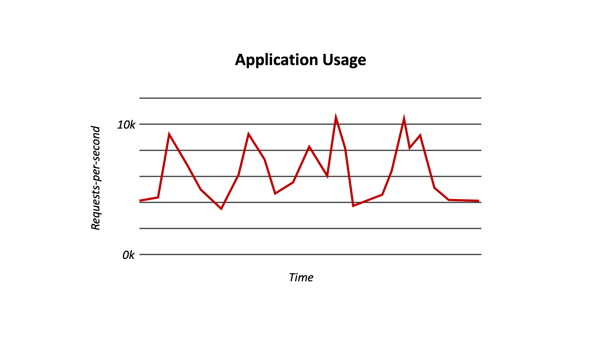

<!--
#
# Licensed to the Apache Software Foundation (ASF) under one or more
# contributor license agreements.  See the NOTICE file distributed with
# this work for additional information regarding copyright ownership.
# The ASF licenses this file to You under the Apache License, Version 2.0
# (the "License"); you may not use this file except in compliance with
# the License.  You may obtain a copy of the License at
#
#     http://www.apache.org/licenses/LICENSE-2.0
#
# Unless required by applicable law or agreed to in writing, software
# distributed under the License is distributed on an "AS IS" BASIS,
# WITHOUT WARRANTIES OR CONDITIONS OF ANY KIND, either express or implied.
# See the License for the specific language governing permissions and
# limitations under the License.
#
-->

# Final Exam

## What is serverless?

1. IBM Cloud Functions scales your actions automatically only in response to event triggers.

(x) false
(!) true

[explanation]
False.  ICF also scales your actions automatically in response to web or HTTP API invocations if you have enabled them as web actions and/or created a private or public API for them.  
[explanation]

---

1. You are given the following graph of usage for an application you are developing. Which of the following is a correct conclusion of the graph?

<!--  -->

(!) The usage is mostly constant, so serverless computing would be a good fit for this usage case.
( ) The usage is mostly sporadic, so serverless computing is a good fit for this usage case.
(x) The usage is mostly constant, so serverless computing would be a bad fit for this usage case.
( ) The usage is mostly sporadic, so serverless computing is a bad fit for this usage case.

[explanation]
The usage graphs shows that requests to the application are very fairly constant with request rate averaging roughly 6k over the provided time interval. In this usage case, it is likely more cost effective to pay for dedicated servers (computing services) with enough planned capacity to handle such a load.
[explanation]

## Create and invoke actions

1. Actions cannot directly invoke other actions without using a sequence.

(!) true
(x) false

[explanation]
False. Actions can invoke other actions, acting as a proxy, using the NPM Apache OpenWhisk JavaScript library.

<code>var openwhisk = require('openwhisk');</code>

[explanation]

1. You are able to pass parameters when invoking an action using the command line directly or indirectly using a parameter file.

(x) true
(!) false

[explanation]
True. Parameters can be passed directly when invoking an action using the <code>--param</code> flag or indirectly from a file using the  <code>--param-file</code> flag.
[explanation]

### Managing Actions with Packages

1. If you have many Packages, you can better organize them by creating a Package that contains several similar packages.

(!) true
(x) false

[explanation]
False. Package nesting is not allowed, i.e. packages cannot contain other packages.
[explanation]

### Connecting Actions to Event Sources

1. Multiple triggers can be configured to fire the same action.

(!) incorrect
(x) correct

[explanation]
Correct. Multiple triggers can be connected to the same action using separate rules.  This allows similar event data doming from different event sources to be processed by the same serverless action.
[explanation]

### Exposing APIs from Actions

### Use the Web User Interface (Web UI)

1. If you wish to monitor your action invocations, you need to use the web user interface.

(!) true (x) false

[explanation]
False. The CLI's `action poll` command allows you to see activation records as they are created (live), but you will not get the views and filters the web user interface experience provides.
[explanation]
