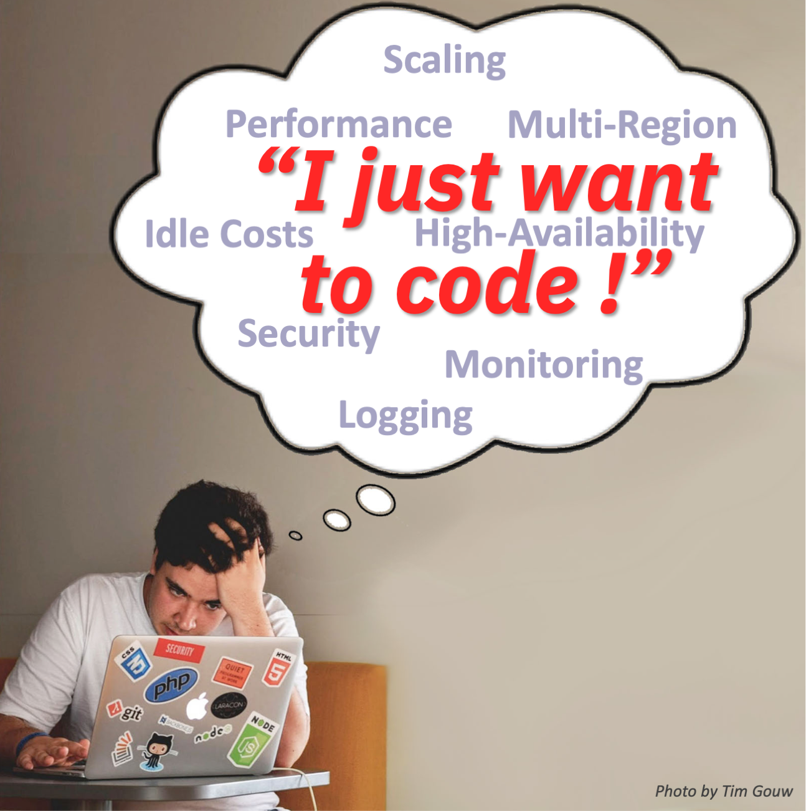

# Characteristics of Serverless for Developers

In today's agile-focused world, Developers are now (more than ever) expected to understand the operational considerations of deploying, hosting and maintaining their applications "on the Cloud"; hence the term "DevOps".

However, this often means less time actually coding business logic and much more time worrying about these operational aspects.

#  Taking the "Ops" out of "DevOps"

In "Developer speak", Serverless...

### “→ NoOps” for the Developer is #1 goal

Providers of Serverless computing strive to **approach** zero operational considerations for the Developer.

### Provider “implements” Ops

with the following goals:

- Maximizing Utilization
    - Compute / Memory / Networking
- Minimizing Compute Costs
    - Pay-As-You-GO (PAYGO) cost model
- Guarantees all the "Ops"
    - Performance, Scaling, Multi-region, High Availability (HA), Security, Monitoring, Logging, etc.
    - _Varies by Service License Agreements (SLAs)_
