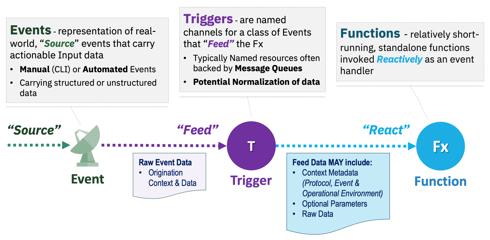

# Serverless Programming Model

## The Least Common Denominator (LCD) view

There is no open standard for Serverless, its programming model, its deployment model or as a consequence its APIs.  Different providers may use different, but similar, semantics to describe the component parts that play a role in taking an event and causing a Serverless function to execute.

Shown below is a basic view of how Serverless works using the most common semantics from the Serverless domain and applicable to IBM Cloud Functions.

# Events and Event Sources

## It all starts with an **Event**

Regardless of implementation or who you discuss Serverless with, it is all about invoking a function based upon an associated event and the data it is designed to operate on.

## These events all come from an **Event Source**

Events that can be associated with functions always come from "real world" or originating sources. In a Serverless programming model, the _Event Source_ can just be conceptual or represent an actual "adapter" service that understands how to receive "raw" event data from the "originator" and turn it into data that a function can process.

Event sources can represent or adapt data from manual or automated originating sources, for example these may include:

### Manual examples

- _Directly_ - from a user calling a front-end API (public or private) with data.
- _Indirectly_ - from a user interacting with a website that uses Serverless to generated web content.

### Automated examples

- Periodic "alarm" events to process data on a schedule (e.g., batch jobs)
- Changes data storage devices (e.g., SQL databases, S3 Cloud Object Storage)
- Messages received on a Message Queue (e.g., Kafka, Rabbit MQ)
- Email messages
- Mobile "push" notifications
- IoT sensor data (e.g., Vehicle performance data, weather data)


The conceptual list of automated sources that can be processed by Serverless functions is of course endless!


## Why does ICF use **Triggers**

Triggers are not part of every Serverless programming model, but are a powerful concept within IBM Cloud Functions that supports the [Observer design pattern](https://en.wikipedia.org/wiki/Observer_pattern) effectively.

In IBM Cloud Functions, the _Trigger_ is a programmatic construct that represents a "class of" or "stream of" events that is suitable for one or more associated functions to process.  In this pattern the functions themselves are the _Observers_ or "sinks" (for the event data).  This loose association allows both the functions and the _Event Sources_to remain independent from and agnostic to any specific underlying event processing implementations.


The name _Trigger_ in our model, since it ultimately invoke a function, is intended to draw upon the analogy of "firing" a weapon.  Therefore, you will often hear or see the terms _"triggering"_ or _"firing"_ a function used instead of _"invoke"_.


# Why call a function an **Action**?

Within the ICF programming model, the _Action_ represents more than just the actual functional code that gets executed
