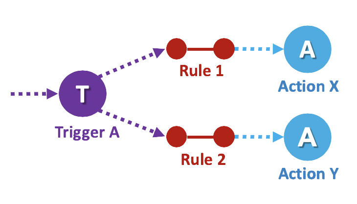
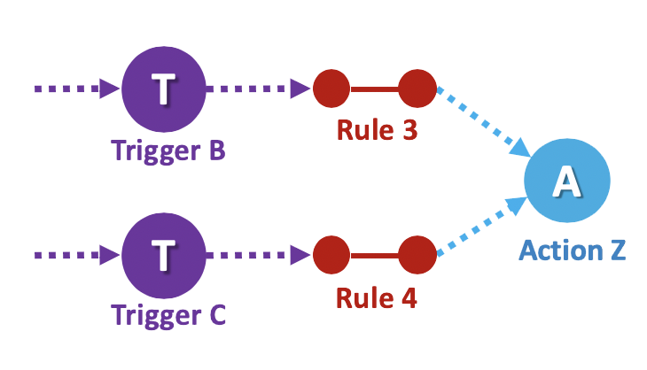

# IBM Cloud Functions Programming Model explained

## The Least Common Denominator (LCD) view

There is no singular open standard for Serverless, its programming model, its deployment model or as a consequence its APIs.  Different providers may use different, but similar, semantics to describe the component parts that play a role in taking an event and causing a Serverless function to execute.

Shown below is a basic view of how Serverless works using the most common semantics from the Serverless domain and applicable to IBM Cloud Functions.

## It all starts with an **Event**

Regardless of implementation or who you discuss Serverless with, it is all about invoking a function based upon an associated event and the data it is designed to operate on.

## These events all come from an **Event Source**

Events that can be associated with functions always come from "real world" or originating sources. In a Serverless programming model, the _Event Source_ can just be conceptual or represent an actual "adapter" service that understands how to receive "raw" event data from the "originator" and turn it into data that a function can process.

Event Sources can represent entities that produce event data from manual or automated originating events. These may include:

#### Manual sources

- _Directly_ - from a user calling a front-end API (public or private) with data.
- _Indirectly_ - from a user interacting with a website that uses Serverless to generated web content.

#### Automated sources

- Periodic "alarm" events to process data on a schedule (e.g., batch jobs)
- Changes data storage devices (e.g., SQL databases, S3 Cloud Object Storage)
- Messages received on a Message Queue (e.g., Kafka, Rabbit MQ)
- Email messages
- Mobile "push" notifications
- IoT sensor data (e.g., Vehicle performance data, weather data)


The conceptual list of automated sources that can be processed by Serverless functions is of course endless!


## The **Feed** is the event adapter

In the case of ICF's model, the _Event Source_ is more conceptual and the **Feed** actually represents an "adapter" service in the system that understands how to connect to and/or receive data from an _Event Source_, adapt it to a normalized form and then "feed" it to one or more functions by invoking _Triggers_.

Feeds follow one of three patterns:

### Hook

A feed uses a "webhook" facility or "callback" mechanism exposed by an external  service that generates events (i.e., an event source).

### Polling

A service that polls an external service endpoint periodically to fetch new data and generate its own "events".

### Connection

A dedicated service running somewhere that maintains a persistent connection to an event source (e.g., implements a client of a message queue service or database) creates events. These types of feed implementations are called event **Provider Services**.


Later in the course, we will show how to actually implement a **Polling Feed Service** using a Serverless function that is periodically triggered from an  Alarm!


## Why does ICF use **Triggers**?

Triggers are not part of every Serverless programming model, but are a powerful concept within IBM Cloud Functions that supports the [Observer design pattern](https://en.wikipedia.org/wiki/Observer_pattern) effectively.

In IBM Cloud Functions, the _Trigger_ is a programmatic construct that represents a "class of" or "stream of" events that is suitable for one or more associated functions to process.  In this pattern the functions themselves are the _Observers_ or "sinks" (for the event data).  This loose association allows both the functions and the _Event Sources_ to remain independent from and agnostic to any specific underlying event processing implementations.


The name _Trigger_ in our model is intended to draw upon the analogy of _"triggering"_ or _"firing"_ a weapon; therefore, you may encounter these terms instead of _"invoking"_ or _"calling"_ a function.


## Why call a function an **Action**?

Within the ICF programming model, the _Action_ represents more than just the actual functional code that gets executed.  It also represents the metadata associated with the function itself which includes:

- Logical **Name** used to reference it within a namespace
- **Description** (optional) of function purpose and usage
- **Versioning** (as the code changes over time)
  - _Optional hashing based upon code and signature_
- **Parameter** (input and output) type data and descriptions
- **Parameter defaults** applied when missing from the event data
- **Usage statistics**
- _and more_

As we proceed through the course using IBM Cloud Functions, we will use the term _Action_ more often then the word function. Just know that we are still primarily referencing the function which is central to the _Action_.

## The last piece of the model is the **Rule**

In order for a successful design of the Observer pattern described above, we need to introduce one last logical component to the programming model we have not shown yet called the **Rule**.

Rules are used to _associate one Trigger with one Action_. After this kind of association is created, each time a trigger event is fired, the action is invoked.
They can be viewed as an on/off switch that enables or disables Trigger events reaching an Action.

With an appropriate set of rules, a single Trigger event can invoke multiple Actions, or events from multiple Triggers can invoke the same action.

| 1 Trigger, 2 Actions | 2 Triggers, 1 Action |
:-------------------------:|:-------------------------:
|  | |


As you can see, the IBM Cloud Functions (ICF) programming model has been well thought out and has lead to a robust and powerful implementation of Serverless that you will soon experience first-hand!

