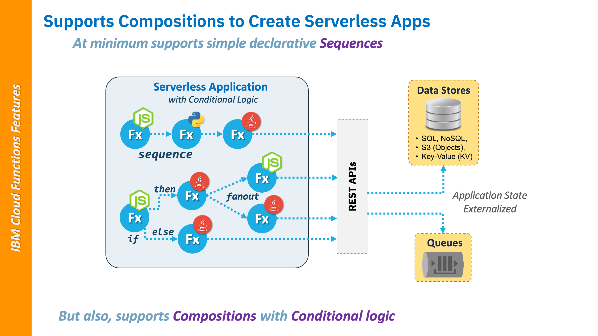

<!--
#
# Licensed to the Apache Software Foundation (ASF) under one or more
# contributor license agreements.  See the NOTICE file distributed with
# this work for additional information regarding copyright ownership.
# The ASF licenses this file to You under the Apache License, Version 2.0
# (the "License"); you may not use this file except in compliance with
# the License.  You may obtain a copy of the License at
#
#     http://www.apache.org/licenses/LICENSE-2.0
#
# Unless required by applicable law or agreed to in writing, software
# distributed under the License is distributed on an "AS IS" BASIS,
# WITHOUT WARRANTIES OR CONDITIONS OF ANY KIND, either express or implied.
# See the License for the specific language governing permissions and
# limitations under the License.
#
-->

# Writing Serverless Apps with IBM Cloud Functions

Mature Serverless platforms, such as IBM Cloud Functions, provide features that allow you to build cloud-native applications by composing your Serverless functions into more complex data transformations and workflows.

This section will describe some ICF-specific features that differentiate it from other Serverless platforms and enable developers in writing truly amazing Serverless applications.

## What's a Polyglot?

IBM Cloud Functions is a polyglot Serverless platform meaning it understands and supports multiple programming languages for authoring functions.

This allows developers to choose the language that works best for them, which can:

- Reduce the need to learn new languages
- Increase code reuse _simplifying migration_
  - Especially important when integrating with services and data sources that provide libraries in specific languages.
- Leverage language-specific knowledge to code more efficient functions

### **ICF Supported languages**

The ICF team attempts to provide all the most popular Serverless languages and versions; their current list of supported language "runtimes" can always be found here:
[Runtimes](https://cloud.ibm.com/docs/openwhisk?topic=cloud-functions-runtimes)

This currently includes the lastest LTS releases for:

- **NodeJS**
- **Python**
- **Swift**
- **PHP**

If your language is not supported, you can always create your own language runtime using a Docker skeleton or build from compatible runtimes for other languages from the Apache OpenWhisk project:

- [Apache OpenWhisk -> Downloads -> Action Runtimes](https://openwhisk.apache.org/downloads.html#component-releases)

## Using Namespaces and Packages

ICF provides a naming convention that allows developers to organize their functions and apply access control.  Every entity in ICF can have a Fully-Qualified Name (FQN) with the following path-style format:

```text
/<Namespace Name>/<Package Name>/<Entity Name>
```

- _where `Enitity Name` is the name of your Action, Trigger or Rule_

### Namespaces

Actions, Triggers, and Rules always belong in a namespace. If a namespace is not explicitly provided, they are created in a default namespace.

Namespaces are where Access Control can be applied to your Actions, Triggers and Rules requiring authorization provided by IBM's Cloud Identity and Access Management (IAM) services when others want to use them to create their applications.


- Read more on [Managing Namespaces](https://cloud.ibm.com/docs/openwhisk?topic=cloud-functions-namespaces)


### Packages

Packages are logical, named groupings that can contain Actions and Feeds. A package cannot contain another package, so package nesting is not allowed.

Actions and Feeds do not need to belong to a package, but then developers would have to worry about **name collisions** causing referencing issues.

Serverless application developers should always creating unique, meaningful package names to better allow them to be reused across multiple Serverless applications.


Read more on [Incorporating Packages](https://cloud.ibm.com/docs/openwhisk?topic=cloud-functions-pkg_ov) in your ICF applications.


## Using Sequences and Compositions



### **Sequences**

This class will show you how to create Action Sequences which ICF manages for you.  Actions in sequences can be written in any language as long as the data format from output from one Action is compatible with the input expected by the next Action in a sequence.

Typically data between actions is normalized in JSON format, but Actions and sequences are not limited to just JSON format.

### **Compositions**

IBM Cloud Functions is one of the few Serverless platforms that offers the ability to compose polyglot function into programmatic workflows using a rich set of conditional logic and programming friendly constructs.


This course will not cover Compositions, but more information can be found here in GitHub: [IBM Cloud Functions Composer](https://github.com/ibm-functions/composer)



🎉_**Congratulations**! Now you have an overview of all you need to know to begin writing your own Serverless Applications using IBM Cloud Functions as part of this course!_ 🎉

