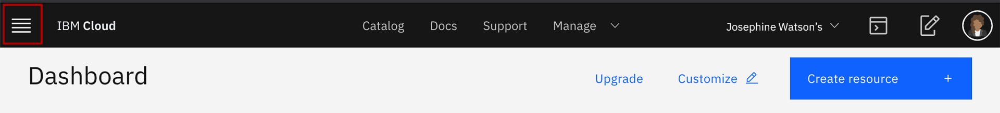
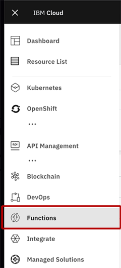

# Use the Web User Interface (Web UI)

This exercise will introduce the [IBM Cloud Functions Web UI](https://cloud.ibm.com/functions/). This application helps to manage your IBM Cloud Functions (ICF) applications from a web browser, rather than using the command line.

Once you have completed this exercise, you will:

* Understand how to find and use the ICF Web UI within IBM Cloud
* Have performed the same tasks within the web UI as you did from the CLI

Once this exercise is finished, you will be able to use the Web UI to build and manage serverless applications on IBM Cloud!

## Background

ICF comes with a Web UI to help developers manage their serverless applications. Common development tasks such as creating actions, monitoring invocations, setting up triggers, and more, can all be achieved using this web application. The web application is custom to IBM Cloud and is **not** part of the open source Apache OpenWhisk project.

It can often be quicker to use the Web UI for certain development tasks, rather than typing repetitive CLI commands. The Web UI integrates with the IBM Cloud interface, making it easy to provision and connect new cloud services to your applications.

This exercise introduces  the different features of the IBM Cloud Web UI.

## Navigate to the ICF Homepage

1. Open the [IBM Cloud homepage](https://cloud.ibm.com/).
2. Click the hamburger menu icon in the top left corner to show the menu.

3. Click "Functions" in the list to open the [ICF homepage](https://cloud.ibm.com/functions/).

