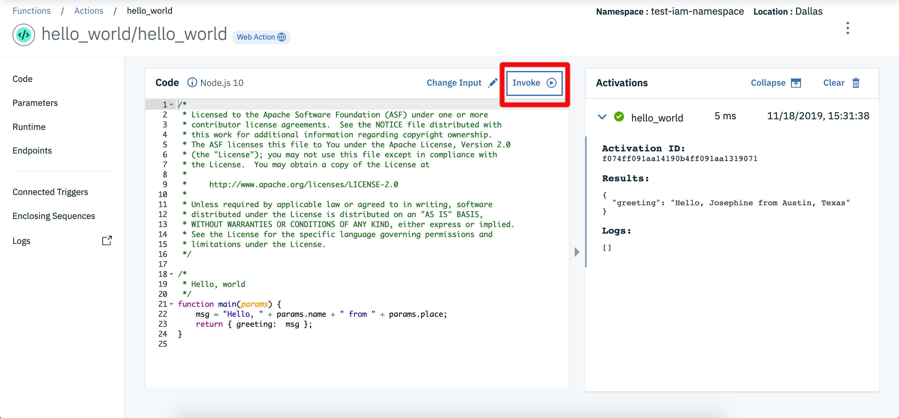
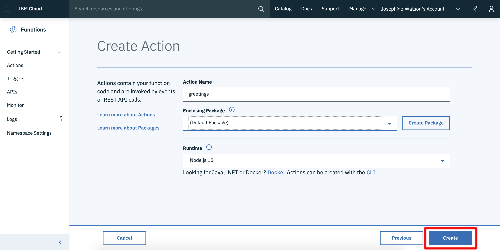

# Managing actions

## List actions for a namespace and region

1. Select "Actions" from the left-hand menu panel on the IBM Cloud **Functions** homepage which will display the [Management page for actions](https://cloud.ibm.com/functions/actions). It shows actions created within the selected IBM Cloud namespace and region.

The following screenshot shows a listing of actions created in the `test-iam-namespace` namespace in the `Dallas` region:

2. Click on the name of any action listed to move to the action details page.

## Details overview

The action details page shows properties for the chosen action.

For actions written in a supported language runtime, a source code editor with the action code is displayed. It allows users to make live changes and publish them making them immediately available to users.

Using the menu on the left-hand side, different properties for the action can be accessed and modified.

* **Code** shows action source code in editor.
* **Parameters** shows default parameters for the action.
* **Runtime** shows the action runtime, timeout value, and memory limit.
* **Endpoints** allow you to expose the action as a web action.
* **Connected triggers** shows the triggers the action is connected to.
* **Enclosing sequences** shows sequences which use this action.

## Invoke actions

3. Click the "Invoke" button to invoke the action and display the resulting activation record.

_Input parameters to invocations can be modified using the "Change Input" button._

## Creating actions

From the [action create page](https://cloud.ibm.com/functions/actions), new actions can be created by providing the source code through the browser-based editor.

1. Select the "Create" button from the page.

2. Choose "Create Action" from the list.

3. Fill in the "Action name" and choose the "Runtime".
4. Click "Create"

5. Fill in the editor with your action source code.
