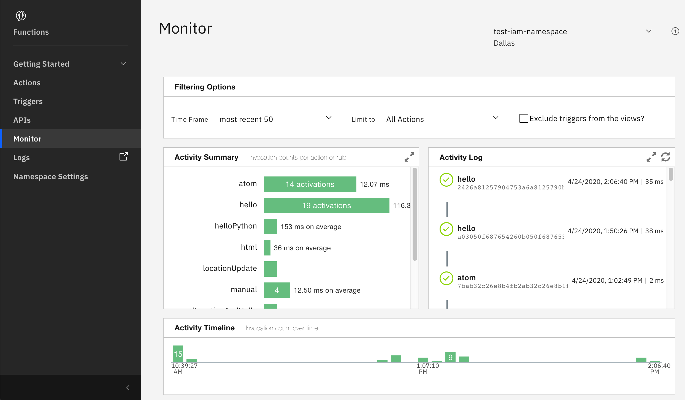
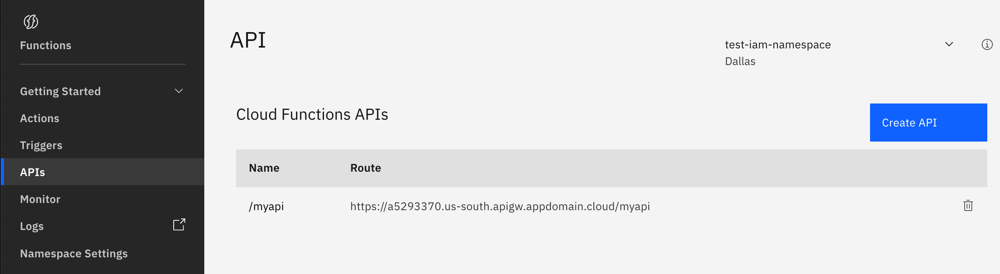
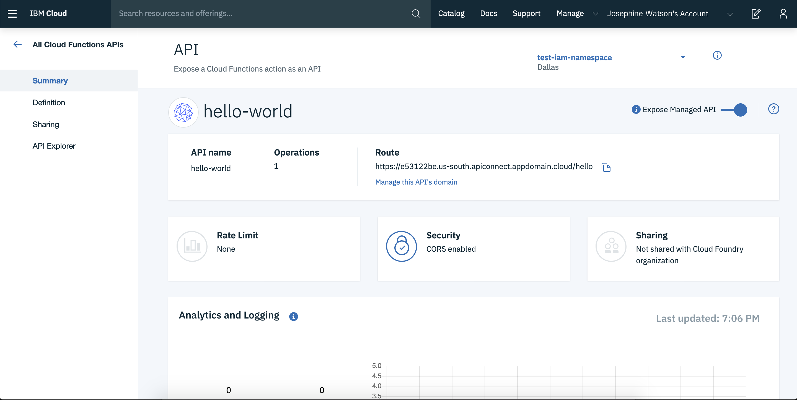
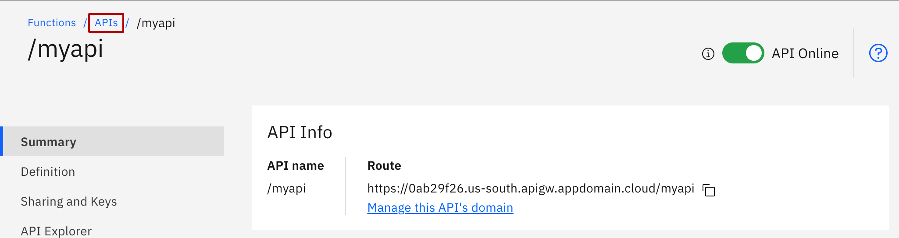
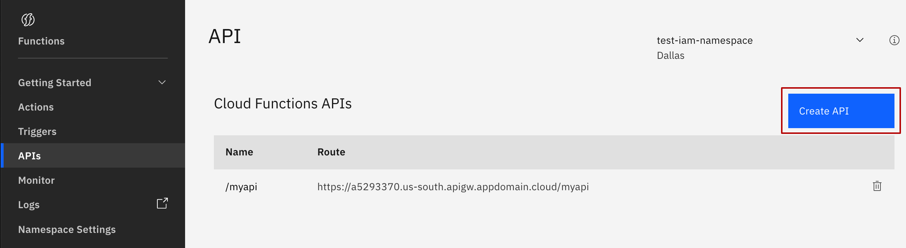
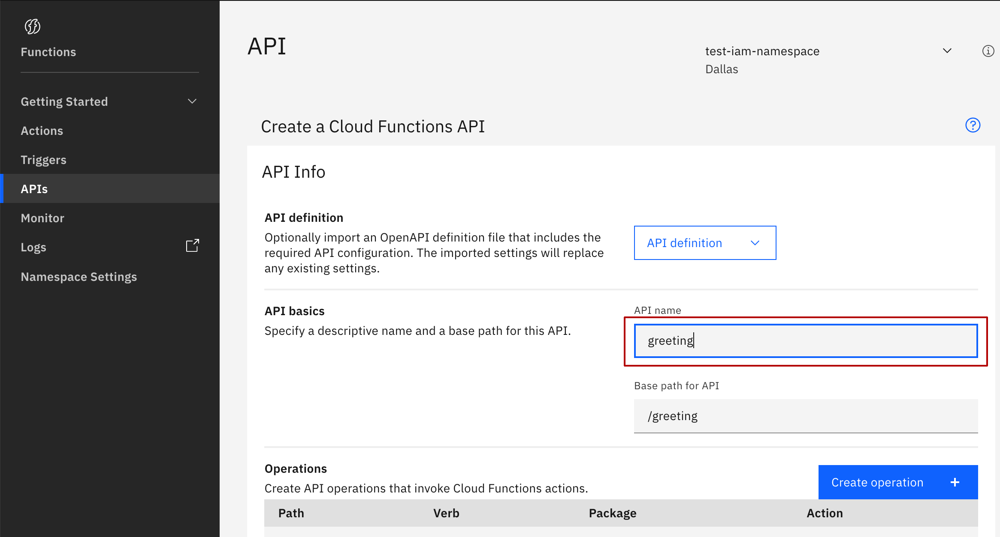
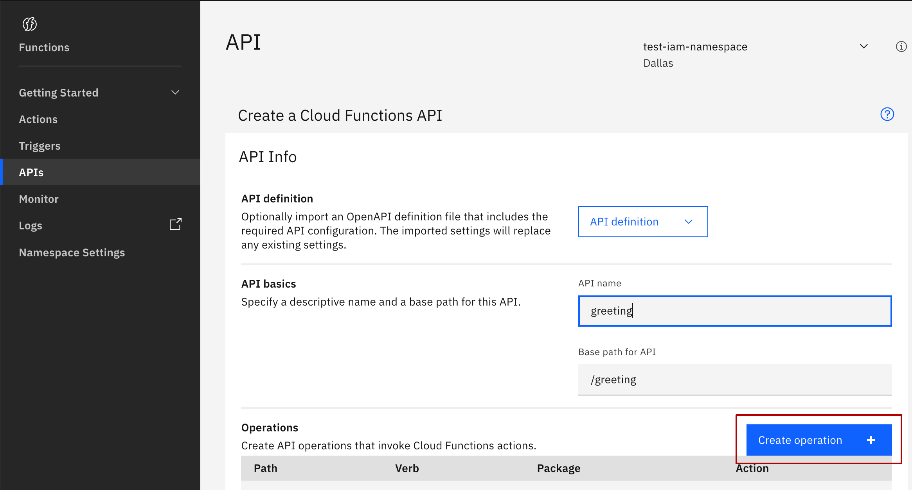
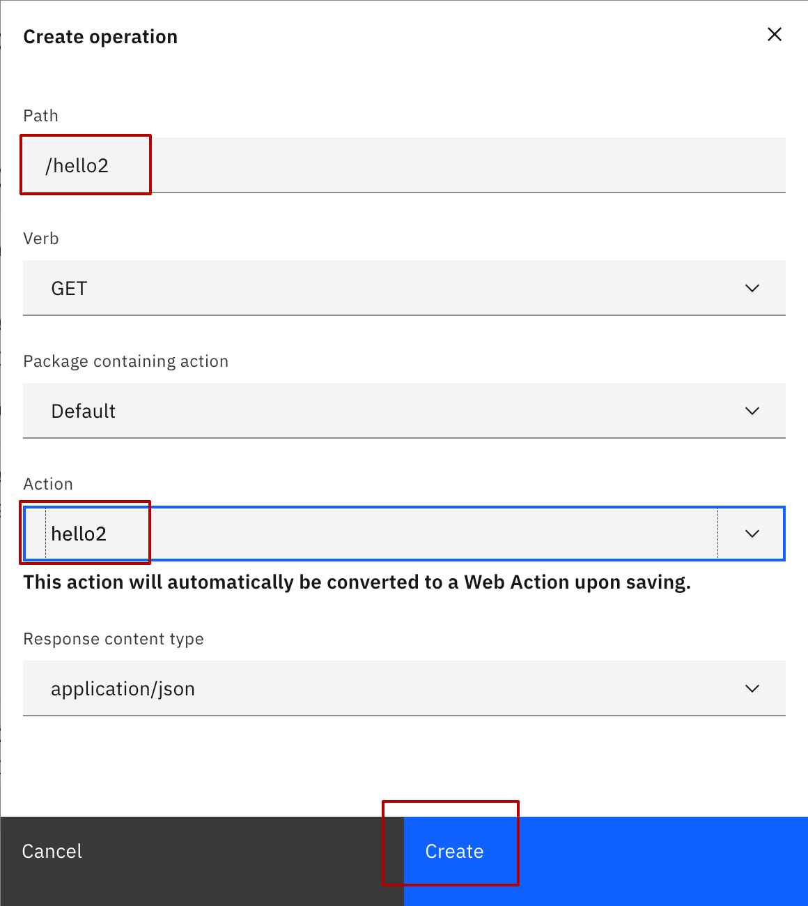
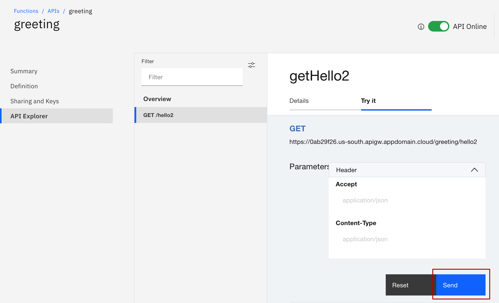
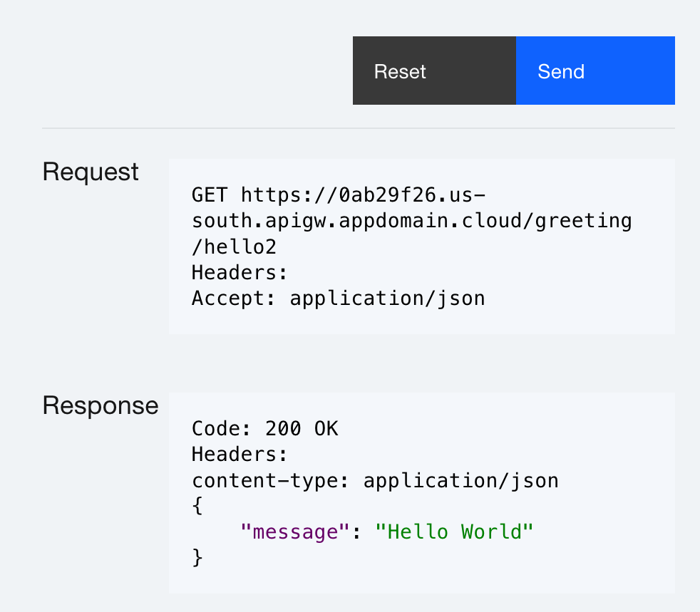

# Monitoring and APIs

## Monitoring activations

IBM Cloud Functions (ICF) Web UI comes with a [comprehensive visualization dashboard](https://cloud.ibm.com/functions/dashboard) for monitoring invocations of actions and triggers within a region and namespace.

Developers can see activation results, invocation times, and logging output through the dashboard. An activation summary and timeline are displayed and can be filtered by action name.  Trigger invocations can also be excluded from the view.

Clicking on an activation ID in the "Activity Log" will show you the complete activation record in either raw or JSON format along with the HTTP request and response headers.

When things are going wrong with your actions, this dashboard will provide a nice starting point to debug the issue.


If you wish to retain and create views on activations across your account, you can setup and connect ICF to the IBM Cloud logging service by clicking on the "Logs" item in the left menu.


## Managing APIs

HTTP endpoints for web actions can be created and managed through the ICF Web UI. Using this interface is often a lot more intuitive than using the CLI tool for managing more complex APIs.

1. Select "APIs" from the left-hand menu panel on the homepage.

### Details overview

The API details page shows properties for the chosen API, including an API monitoring page showing invocations.

Using the menu on the left-hand side, different properties for the API can be accessed and modified.

* **Summary** - API overview page and monitoring dashboard for API invocations.
* **Definition** - API configuration properties, allows updating properties live.
* **Sharing and Keys** - Configure the exposing API with your internal users.
* **API Explorer** - API documentation for your endpoints.

### Create API

Now that we have viewed the API we created from the CLI, let's create a new API using the web interface.

1. Return to the API listing page using the breadcrumb.

2. Click on "Create API” button.

3. Fill out the "API name" field as "myapi".

Notice that the "Base path for API" is automatically filled out using the name you entered by adding a leading forward slash.

4. Click on the "Create Operation" button.

This will display a modal dialog.

5. Fill out the "Path" field as "/hello2" and select the `hello1` action we created earlier from the dropdown list and click "Create".

6. Scroll down to bottom and click "Create".

After creating the operation for your API. you are returned to the actual API create page.  You must scroll down to the bottom and click "Create" to actually create the API:


As you may have noticed, you scrolled past *Security and Rate Limiting* and *CORS* options which are not covered in this course, but are valuable settings for real-world APIs that you can come back and try later.


<!--
#######################################################
TODO: Figure out how to add width="40%" to this image.
#######################################################
-->

6. Select "Explore API" from the left menu.


Although we just created an API with an operation manually, you can also use the OpenAPI specification and manage your APIs via Swagger documents.  In fact, using ICF, you can download the resulting Swagger for any API you create from the CLI or web UI.


### Invoke API

Let's invoke the API we just created from the web interface.

1. Click the "Try it" tab.

2. Click the "Send" button and view the results.


You can even copy the URL generated for your operation and try it from your browser.



Huge congratulations on exploring the ICF web UI! As you can see, you can do everything within the web UI that can be done from the IBM Cloud CLI and the Cloud Functions plugin and more.

