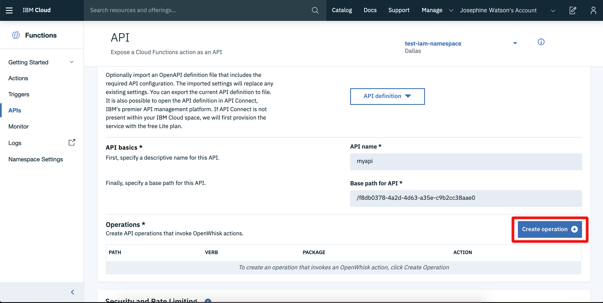
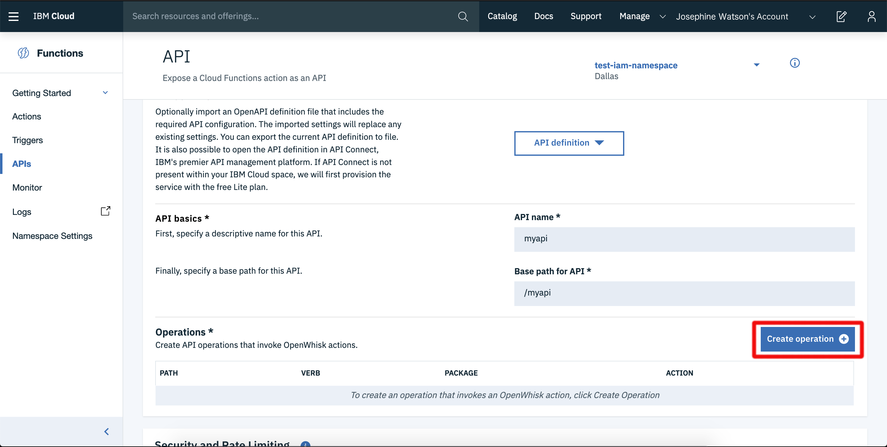
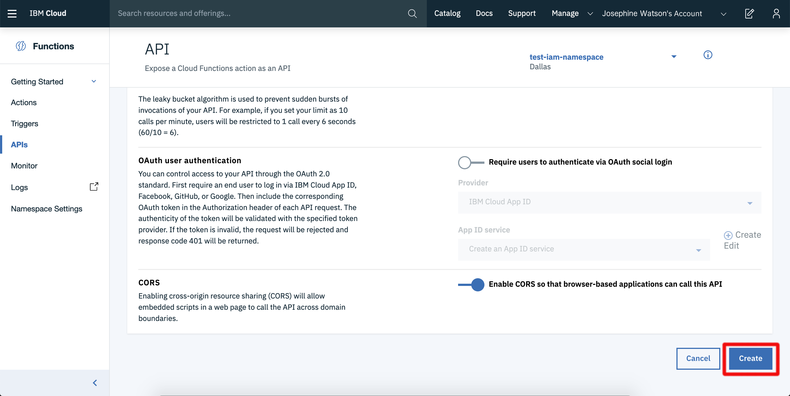

# Monitoring and APIs

## Monitoring

IBM Cloud Functions Web UI comes with a [comprehensive visualisation dashboard](https://cloud.ibm.com/functions/dashboard) for monitoring serverless applications.

This dashboard shows activations within a region, org and space. Developers can see activation results, invocation times and logging output through the dashboard. Activations displayed can be filtered by name or time window.

## APIs

HTTP endpoints for web actions can be created and managed through the IBM Cloud Functions Web UI. Using this interface is often a lot more intuitive than using the CLI tool for managing more complex APIs.

Select "APIs" from the left-hand menu panel on the homepage.

### Details Overview

The API details page will show properties for the chosen API, including an API monitoring page showing invocations.

Using the menu on the left-hand side, different properties for the API can be accessed and modified.

* _"Summary"_ - API overview page and monitoring dashboard for API invocations.
* _"Definition"_ - API configuration properties, allows updating properties live.
* _"Sharing"_ - Configure exposing API with our internal users.
* _"API Explorer"_ - API documentation for your endpoints.

### Creating APIs

Click the "Create API" from the [APIs homepage](https://cloud.ibm.com/functions/).

In this page, API details can either be filled out manually or imported from an existing Swagger file.

1. Click on "Create Managed API

2. Fill out the "API name" field as "myapi"
3. Fill out the "Base path for API" field as "/api"
4. Click on the "Create Operation" button to add new HTTP endpoints to this API.

5. Fill out the "Path" field as "/hello"
6. Choose an action from the drop-down list.
7. Click the "Create" button.

Using the API management create page, security, rate limiting, CORS or oauth support can be configured.

Click the "Create" button at the bottom of the page to create your API.

