# Managing triggers

## List triggers for a namespace and region

1. Select "Triggers" from the left-hand menu panel on the **Functions** homepage which will display the [management page for triggers](https://cloud.ibm.com/functions/triggers). It shows triggers created within the selected IBM Cloud namespace and region.

The following screenshot shows a listing of triggers created in the `test-iam-namespace` namespace in the `Dallas` region:

2. Click on the name of the `locationUpdate` trigger to move to the trigger details page.

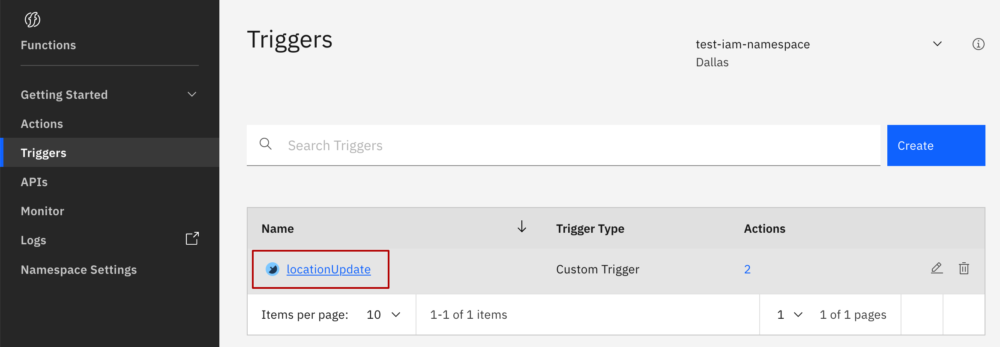

## Details overview

The trigger details page shows properties for the chosen trigger.

In this case, we see that the `locationUpdate` trigger is connected to two actions using the two rules we created earlier.

Using the menu on the left-hand side, different properties for the trigger can be accessed and modified:

* **Connected actions**  shows the actions this trigger is connected to.
* **Parameters** shows default parameters for the action.
* **Endpoints** show details on how to fire this trigger remotely.

You can explore these options later at your convenience.

## Create triggers

1. Return to the [trigger listing page](https://cloud.ibm.com/functions/triggers) using the `Triggers` breadcrumb in the top-left of the page.

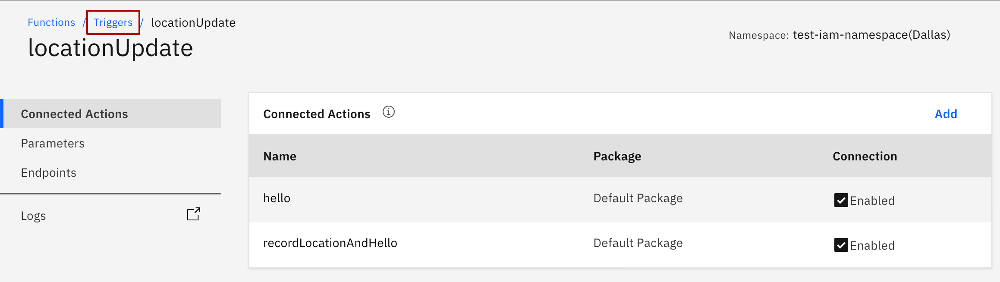

2. Select the "Create" button from the page.

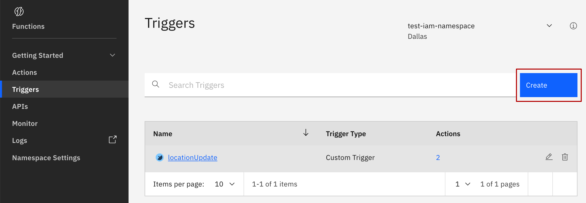

3. Click on "Trigger" from the "Create" entity list.

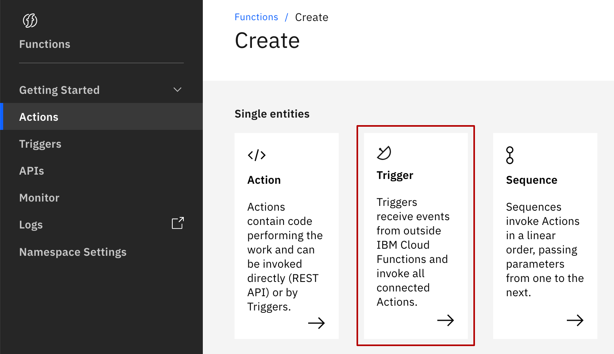

4. Click on "Custom Trigger".

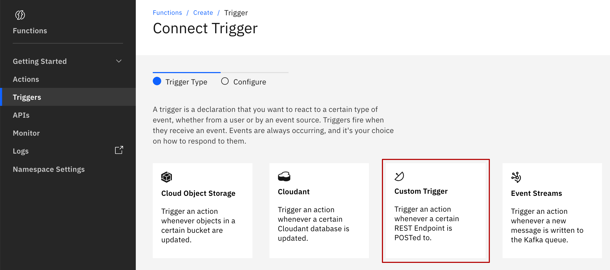

5. Configure the trigger by filling in the  "Trigger Name" and "Description"

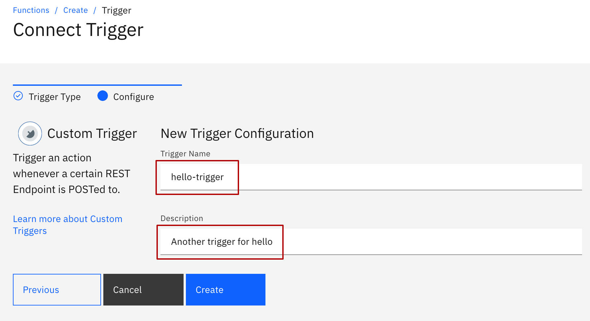

6. Click "Create"

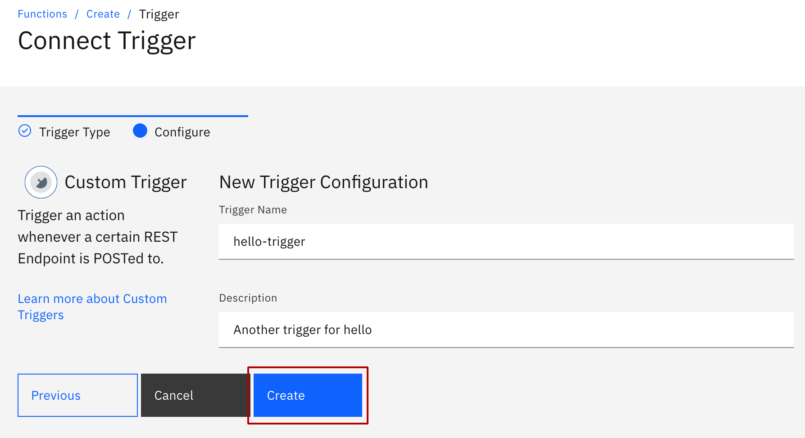

7. Your trigger has been created, but is not yet connected to an action. Click "Add" in "Connected Actions".

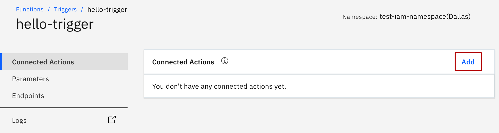

8. Let's connect it to an exiting action. Click "Select Existing".

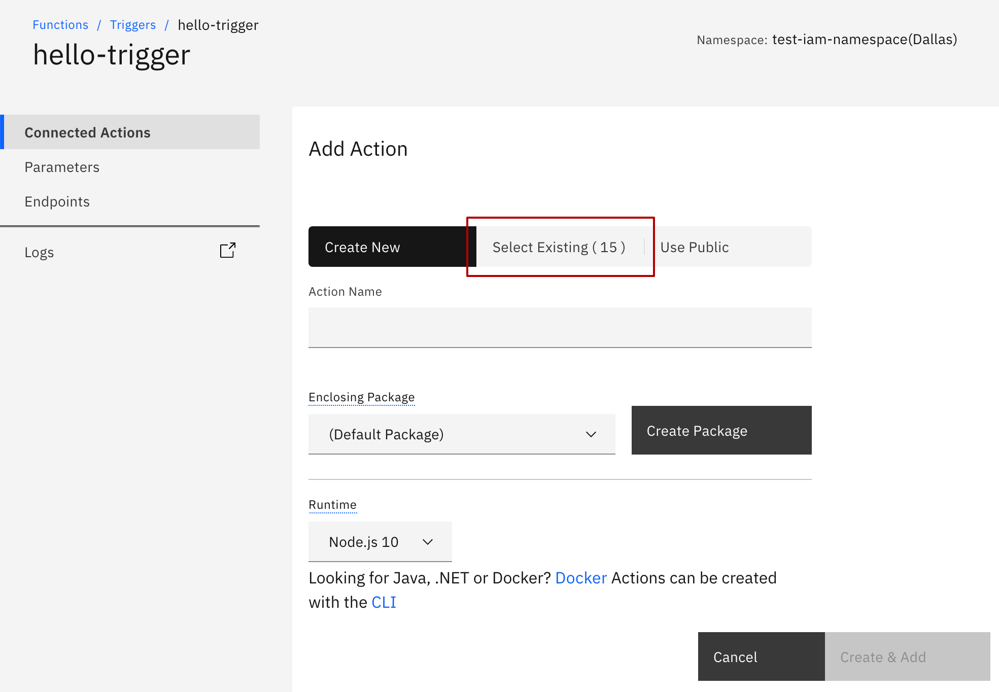

9. Select the `hello` action from the dropdown and click "Add".

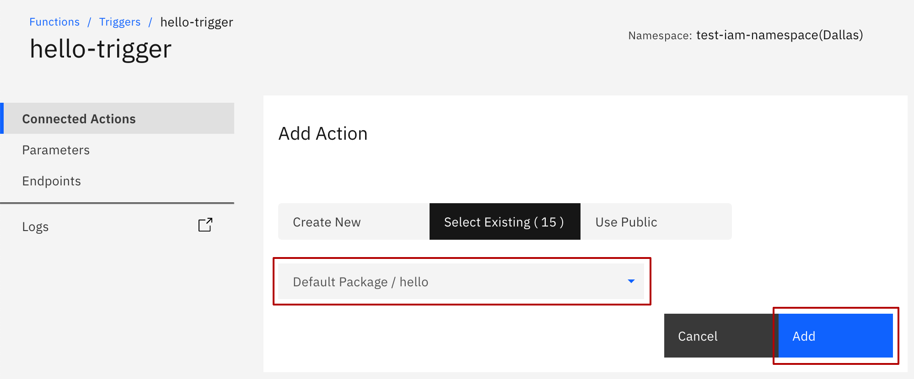

You should now see your new trigger in the trigger details page:

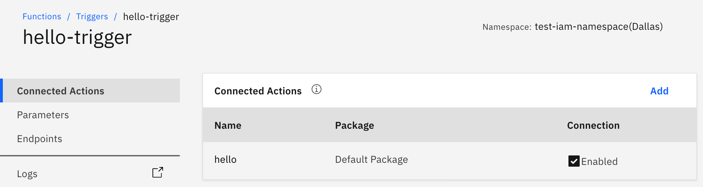


When you connect a trigger to an action, the underlying code of the web UI automatically creates a **rule** "under the covers". The rule, shown as a **Connection** in the details page, is enabled by default.



Kudos! You now can use the web UI to create and connect new triggers to actions as you did in the CLI.

