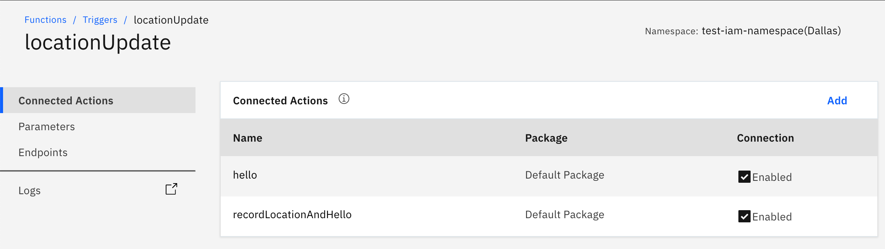
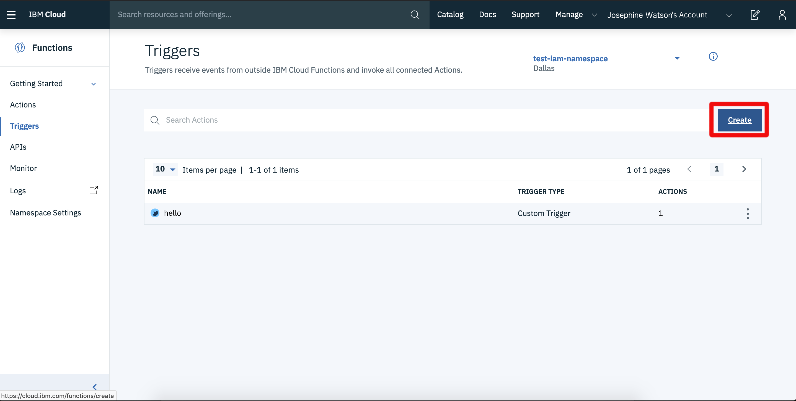
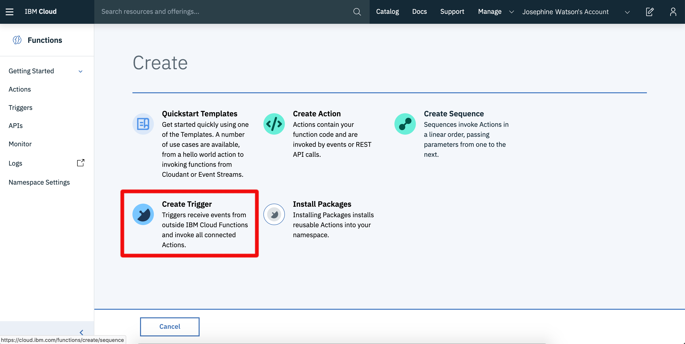

# Managing triggers

## List triggers for a namespace and region

1. Select "Triggers" from the left-hand menu panel on the **Functions** homepage which will display the [management page for triggers](https://cloud.ibm.com/functions/triggers). It shows triggers created within the selected IBM Cloud namespace and region.

The following screenshot shows a listing of triggers created in the `test-iam-namespace` namespace in the `Dallas` region:

2. Click on the name of any trigger listed to move to the trigger details page.

## Details overview

The trigger details page shows properties for the chosen trigger.

Using the menu on the left-hand side, different properties for the trigger can be accessed and modified.

* **Connected actions**  shows the actions this trigger is connected to.
* **Parameters** shows default parameters for the action.
* **Endpoints** show details on how to fire this trigger remotely.

## Create triggers

From the [trigger create page](https://cloud.ibm.com/functions/triggers), new triggers can be created.

1. Select the "Create" button from the page.

2. Choose "Create Trigger" from the list.

3. Choose "Trigger type" as "Custom Trigger"

4. Fill in "Trigger Name" and "Description"
5. Click "Create"

