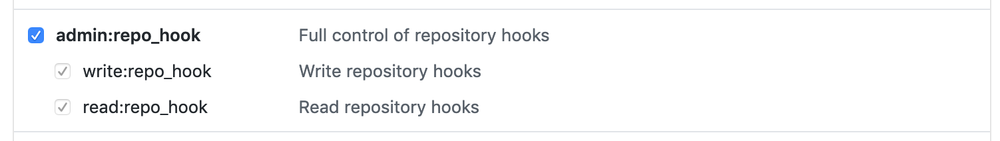

<!--
#
# Licensed to the Apache Software Foundation (ASF) under one or more
# contributor license agreements.  See the NOTICE file distributed with
# this work for additional information regarding copyright ownership.
# The ASF licenses this file to You under the Apache License, Version 2.0
# (the "License"); you may not use this file except in compliance with
# the License.  You may obtain a copy of the License at
#
#     http://www.apache.org/licenses/LICENSE-2.0
#
# Unless required by applicable law or agreed to in writing, software
# distributed under the License is distributed on an "AS IS" BASIS,
# WITHOUT WARRANTIES OR CONDITIONS OF ANY KIND, either express or implied.
# See the License for the specific language governing permissions and
# limitations under the License.
#
-->

# Connecting GitHub events to actions

In this example, we will show how to automatically trigger an IBM Cloud Functions action whenever a "push" of a "commit" is made to a GitHub repository.

## Prerequisites

* **GitHub Account**
  * See [Signing up for GitHub](https://help.github.com/en/github/getting-started-with-github/signing-up-for-github)
* **GitHub Repository**
  * See [Creating a new repository](https://help.github.com/en/github/creating-cloning-and-archiving-repositories/creating-a-new-repository) if you do not have a repository created that you want to use for this example.

## Using the GitHub package

The "built-in" [`/whisk.system/github`](https://github.com/apache/openwhisk-catalog/tree/master/packages/github) package offers a convenient way to use the [GitHub APIs](https://developer.github.com/) in order to create a webhook that can generate events that can fire Cloud Functions triggers.

you can get a summary of the package, its parameters and its single feed action called `webhook`:

```bash
ibmcloud fn package get --summary /whisk.system/github
```

```bash
package /whisk.system/github: Package which contains actions and feeds to interact with Github
   (parameters: *endpoint)
 feed   /whisk.system/github/webhook: Creates a webhook on GitHub to be notified on selected changes
   (parameters: accessToken, events, repository, username)

```

1. Generate a GitHub [personal access token](https://github.com/settings/tokens).

  * **Important** _When [creating your personal access token](https://help.github.com/en/github/authenticating-to-github/creating-a-personal-access-token-for-the-command-line), be sure to select the following **scopes**:_
    * **repo**: **repo:status** to allow access to commit status.

    

    * **admin:repo_hook**: **write:repo_hook** to allow the feed action to create your webhook.

    

  * **Warning** _Make sure that you don't have any webhooks already defined for your repository or they may be overwritten._

1. Verify your personal access token was created successfully with the proper scopes: [https://github.com/settings/tokens](https://github.com/settings/tokens)

1. Create a package binding to the `/whisk.system/github` package.

 The parameters are as follows:

  * `username`: The user name of the GitHub repository.
  * `repository`: The GitHub repository.
  * `accessToken`: Your GitHub personal access token created in Step 1.
  * `events`: The [GitHub event type](https://developer.github.com/v3/activity/events/types/) of interest.

  ```bash
  ibmcloud package bind /whisk.system/github myGit \
    --param username myGitUser \
    --param repository myGitRepo \
    --param accessToken aabbb1111c1d1e1a1a111111aaaaaa1111aa1a1a
  ```

    The `/whisk.system/github/webhook` feed configures a service to fire a trigger when there is activity in a specified GitHub repository.

_**Note** With binding, you don't need to specify the values each time that you use the feed action (i.e., `webhook`) in the package._

## Firing a trigger event with GitHub activity


The following is an example of creating a trigger that will be fired each time that there is a new commit to a GitHub repository.

3. Create a trigger for the GitHub `push` event type by using your `myGit/webhook` feed.

  ```
  wsk trigger create myGitTrigger --feed myGit/webhook --param events push
  ```

  A commit to the GitHub repository by using a `git push` causes the trigger to be fired by the webhook. If there is a rule that matches the trigger, then the associated action will be invoked.

  The action receives the GitHub webhook payload as an input parameter. Each GitHub webhook event has a similar JSON schema, but is a unique payload object that is determined by its event type.

  For more information about the payload content, see the [GitHub events and payload](https://developer.github.com/v3/activity/events/types/) API documentation.

# References

* Apache OpenWhisk's [GitHub package](https://github.com/apache/openwhisk-catalog/tree/master/packages/github) documentation.
* Read more on [Implementing feeds](https://github.com/apache/openwhisk/blob/master/docs/feeds.md) in Apache OpenWhisk.
* [Github Project automation with Cloud Functions](https://github.com/IBM/github-project-automation-with-cloud-functions)
* [Whisk Deploy — GitHub Webhook Trigger](https://medium.com/openwhisk/whisk-deploy-github-webhook-trigger-304a2f47ee52)

