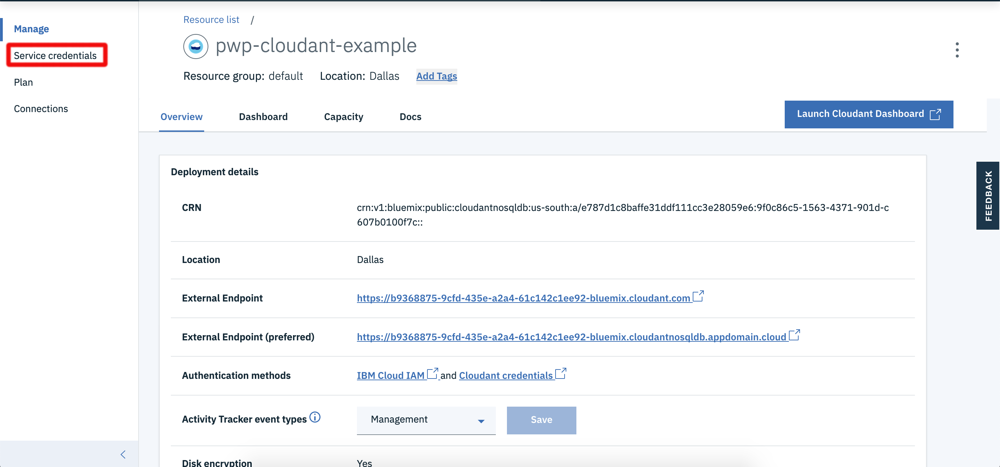
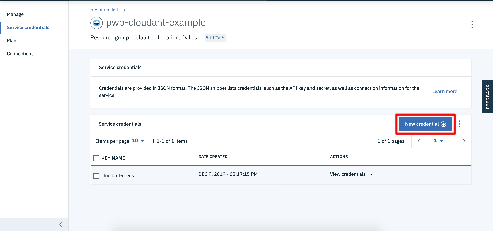
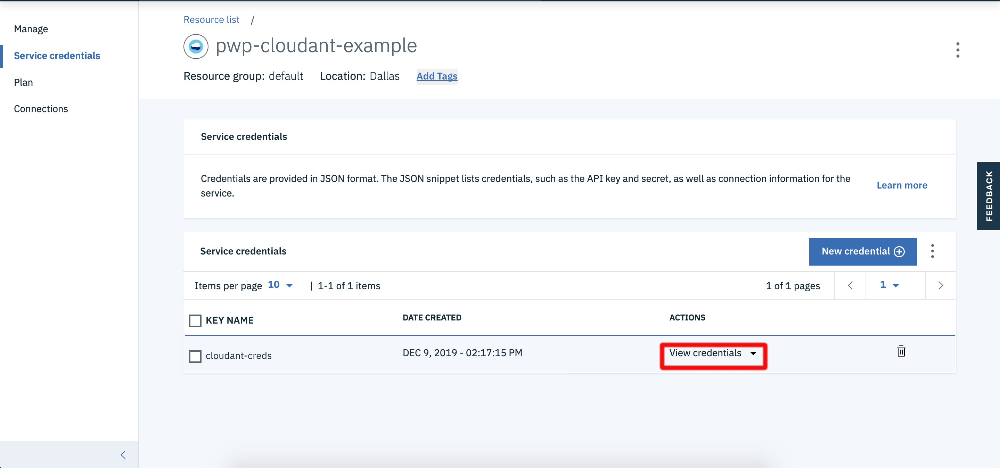
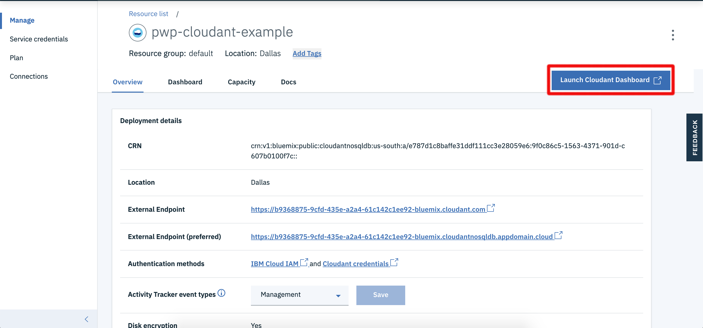
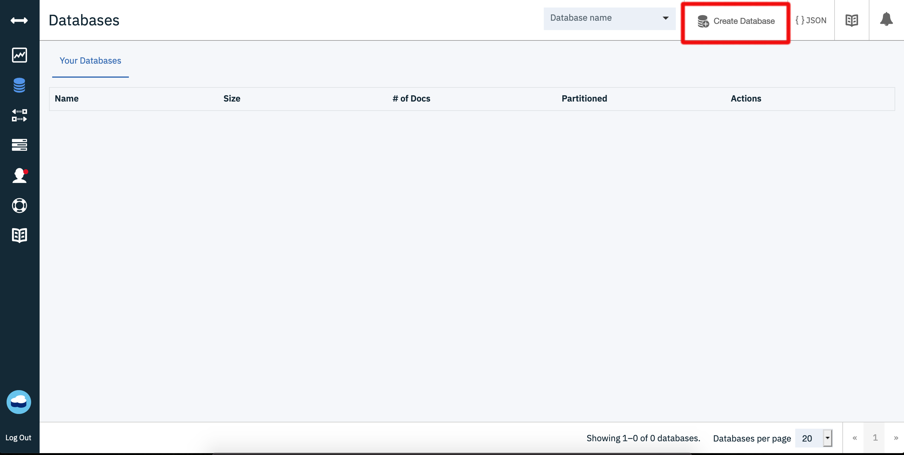
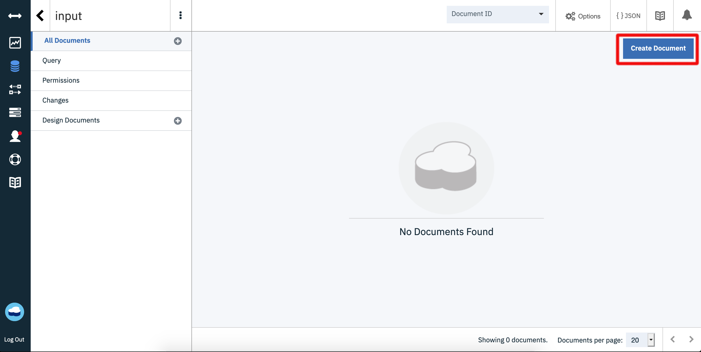
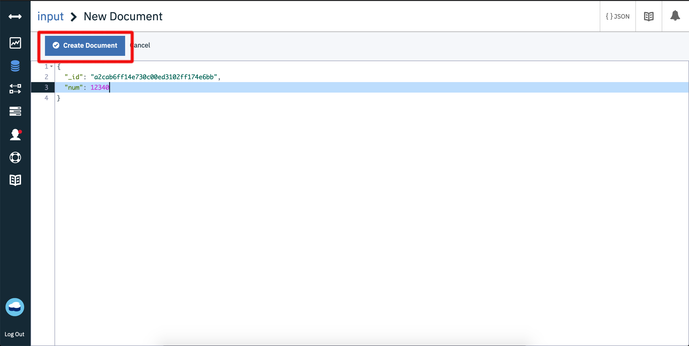
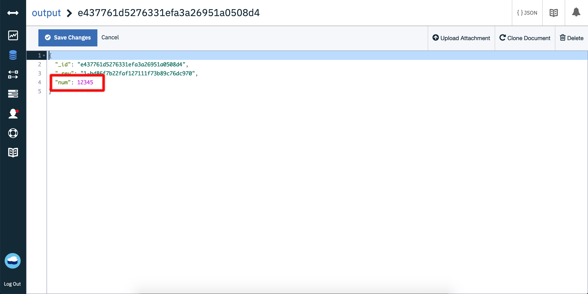

<!--
#
# Licensed to the Apache Software Foundation (ASF) under one or more
# contributor license agreements.  See the NOTICE file distributed with
# this work for additional information regarding copyright ownership.
# The ASF licenses this file to You under the Apache License, Version 2.0
# (the "License"); you may not use this file except in compliance with
# the License.  You may obtain a copy of the License at
#
#     http://www.apache.org/licenses/LICENSE-2.0
#
# Unless required by applicable law or agreed to in writing, software
# distributed under the License is distributed on an "AS IS" BASIS,
# WITHOUT WARRANTIES OR CONDITIONS OF ANY KIND, either express or implied.
# See the License for the specific language governing permissions and
# limitations under the License.
#
-->

# Connecting Cloudant database events to actions

In this example, we will show how to automatically trigger an IBM Cloud Functions action whenever a change is made to a Cloudant database.

## Prerequisites

* **Cloudant Database Instance**
  * Set up [Cloudant](https://cloud.ibm.com/catalog/services/cloudant) instance. You can use a lite instance. Note that you should use both legacy and IAM 
  * Create a new credential for your Cloudant database.
    
    
  * Take note of the `username`, `password`, and `hostname`.
    
  * Create two databases: One named `input` and one named `output`.
    
    

## Using the Cloudant package

In this exercise, we use the "built-in" [`/whisk.system/cloudant`](https://github.com/apache/openwhisk-catalog/tree/master/packages/cloudant) package that fire a trigger events that can activate a Cloud Functions action whenever a change is made to the Cloudant database.

You can get a summary of the package and parameters:

```bash
ibmcloud fn package get --summary /whisk.system/cloudant
```

```bash
package /whisk.system/cloudant: Cloudant database service
   (parameters: *apihost, *bluemixServiceName, dbname, host, iamApiKey, iamUrl, overwrite, password, username)
 action /whisk.system/cloudant/delete-attachment: Delete document attachment from database
   (parameters: attachmentname, dbname, docid, docrev, params)
 action /whisk.system/cloudant/update-attachment: Update document attachment in database
   (parameters: attachment, attachmentname, contenttype, dbname, docid, docrev, params)
 action /whisk.system/cloudant/read-attachment: Read document attachment from database
   (parameters: attachmentname, dbname, docid, params)
...

```

## Binding the Cloudant package with your Cloudant login credentials

1. Create a package binding named `myCloudant` to the `/whisk.system/cloudant` package with your username, password, and host.

    ```bash
    ibmcloud package bind /whisk.system/cloudant myCloudant \
      --param username myCloudantUsername \
      --param password myCloudantPassword
      --param host myCloudantHost \
    ```

    Replace:
    * `myCloudantUsername` with the username we took note of in the credentials
    * `myCloudantPassword` with the password from the credentials.
    * `myCloudantHost` with the Cloudant host from the credentials

    _**Note** by binding your Cloudant information to the package, you don't need to specify the values each time that you call the feed action ._

## Firing a trigger event with Cloudant Database activity

The following is an example of creating a trigger that will be fired each time that there is activity in the `input` database.

1. Create a trigger for the Cloudant `change` events in the database input using your `myCloudant/changes` feed

    ```bash
    ibmcloud fn trigger create new-input-number --feed /_/myCloudant/changes --param dbname input
    ```

    The `/whisk.system/cloudant/changes` feed action creates a stream that fires a `new-input-number` trigger when there is activity in the `input` database in our Cloudant instance.


  **Congratulations!** _Now any activity on the `input` database will causes the trigger to be fired. Let's continue and create a Rule that associates `new-input-number` to an actual Action to be invoked._

### Connecting an Action to the Trigger

1. Create a function `addfive.js` that takes input called `doc.num` in JSON

    ```javascript
    function main(params) {
        return {
            doc: { num: params.num+5 },
            dbname: "output"
        }
    }
    ```

1. Create the Action named `add-five`

    ```bash
    ibmcloud fn action create add-five add-five.js
    ```

    This action receives the a payload with `num` as an input parameter. It then returns a JSON object with `doc` containing a key called `num` that is 5 added to the input, and a `dbname` to output to. This format may seem weird, but will allow use to create a sequence of actions that will work together to read the input database, add 5 to the input `num`, and write it to the `output` database.

1. Create a sequence named `add-five-sequence`
   ```bash
   ibmcloud fn action create add-five-sequence --sequence myCloudant/read,add-five,myCloudant/create-document
   ```
   This action sequence takes the document id returned by the feed, reads in the document using `myCloudant/read`, passes it to `add-five`, and creates a new document in the `output` database using the `myCloudant/create-document`. Notice that the credentials are being silently passed to the `myCloudant` action thanks to the bound parameters we created.


1. Connect the `new-input-num` Trigger to the `add-five-sequence` Action with a Rule named `respond-to-input`

    ```bash
    ibmcloud fn rule create respond-to-input new-input-number add-five-sequence
    ```

## Test the GitHub event hook

1. In a separate bash terminal window, start polling for activations

    ```bash
    ibmcloud fn activation poll
    ```

    where we will watch for activations from our `print-github-commits` action.

1. Navigate to our Cloudant Dashboard instance in your browser and create new document in the `input` database with a `num` key and a number as the value.

    
    


    In a few seconds, you should see an activation appear in your polling window that looks  something like:

    ```bash
    Enter Ctrl-c to exit.
    Polling for activation logs
    
    Activation: 'create-document' (76a657519f5944aba657519f59b4ab76)
    [
        "2019-12-12T16:13:39.762352Z    stdout: success { ok: true,",
        "2019-12-12T16:13:39.762405Z    stdout: id: 'c9615a2944b2ba6c48d3da463729fc62',",
        "2019-12-12T16:13:39.762411Z    stdout: rev: '1-fef76a10d86073bc8c88f1680fbf2cbe' }"
    ]
    
    Activation: 'add-five' (331ddac0607942739ddac060793273ca)
    []
    
    Activation: 'read' (39678aff53004c26a78aff5300bc26c5)
    [
        "2019-12-12T16:13:39.106808Z    stdout: success { _id: 'd199b00873628e1f9d3ec77fcc434264',",
        "2019-12-12T16:13:39.106851Z    stdout: _rev: '1-1a52fff271d86a0b057dc03fac3b0550',",
        "2019-12-12T16:13:39.106856Z    stdout: num: 10001 }"
    ]
    
    Activation: 'add-five-sequence' (9a9ea9ccec8449659ea9ccec8469652d)
    [
        "39678aff53004c26a78aff5300bc26c5",
        "331ddac0607942739ddac060793273ca",
        "76a657519f5944aba657519f59b4ab76"
    ]
    
    Activation: 'new-input-number' (7434b1f4ed57465bb4b1f4ed57f65b4e)
    [
        "{\"statusCode\":0,\"success\":true,\"activationId\":\"9a9ea9ccec8449659ea9ccec8469652d\",\"rule\":\"josephine.watson@gmail.com_ns/respond-to-input\",\"action\":\"josephine.watson@gmail.com_ns/add-five-sequence\"}"
    ]

    ```
  Finally by checking the output database, we should see a new document having the same number but with five added to it.
  

  **Congratulations!** _You are now automatically triggering an action based on changes in your Cloudant database!!!!_

# References

* As the `/whisk.system/cloudant/changes` is an implementation of a feed, you may want to read more on [Implementing feeds](https://github.com/apache/openwhisk/blob/master/docs/feeds.md) in Apache OpenWhisk.
* Apache OpenWhisk's [Cloudant package](https://github.com/apache/openwhisk-package-cloudant) documentation has a more terse (yet canonical) description of the `/whisk.system/cloudant` package.
* IBM Developer's [Use cloud functions to send your data to your blockchain](https://developer.ibm.com/tutorials/use-cloud-functions-to-send-your-data-to-your-blockchain/) shows you how to use IBM Cloud Functions with Cloudant, Kubernetes, and Blockchain technologies.
  * [GitHub source](https://github.com/IBM/ibm-cloud-functions-serverless-blockchain) contains the code described in the article.
* [Additional Cloudant Trigger Documentation](https://github.com/ibm-functions/trigger-cloudant)

