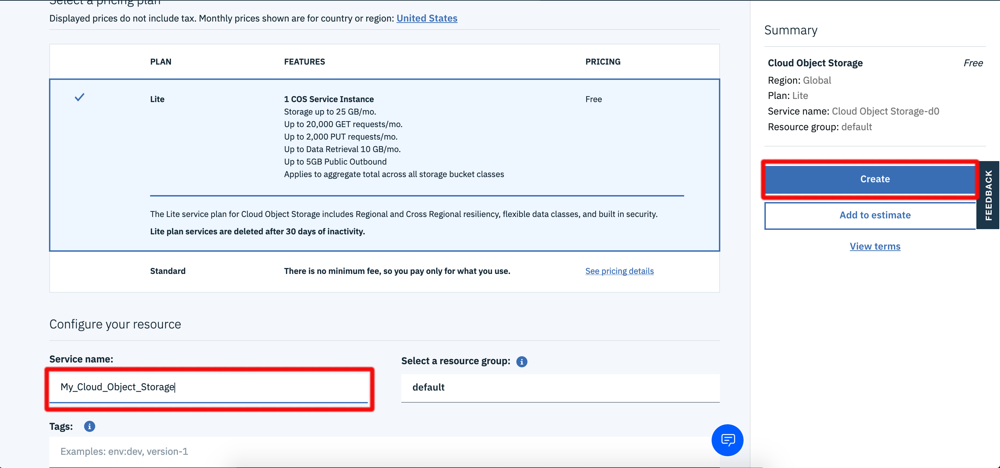
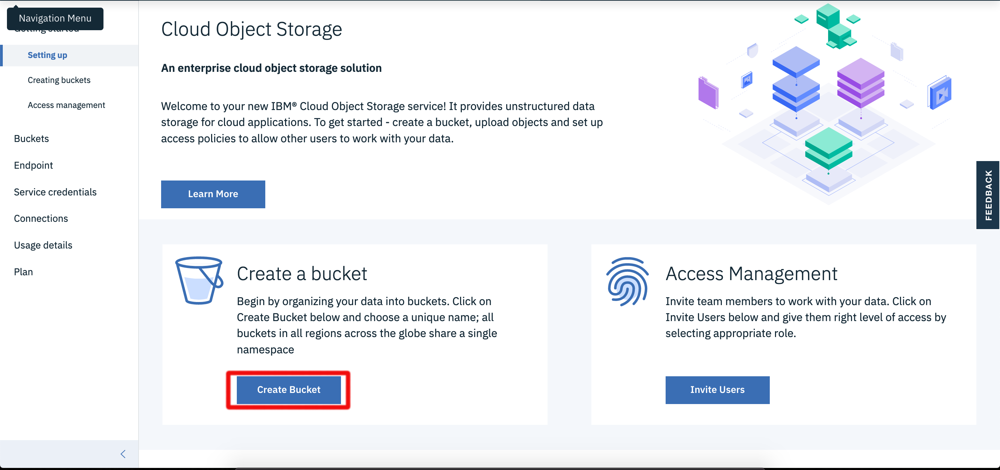
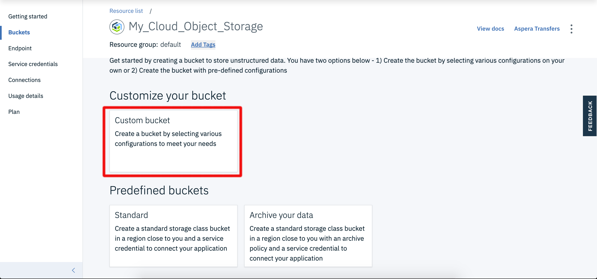
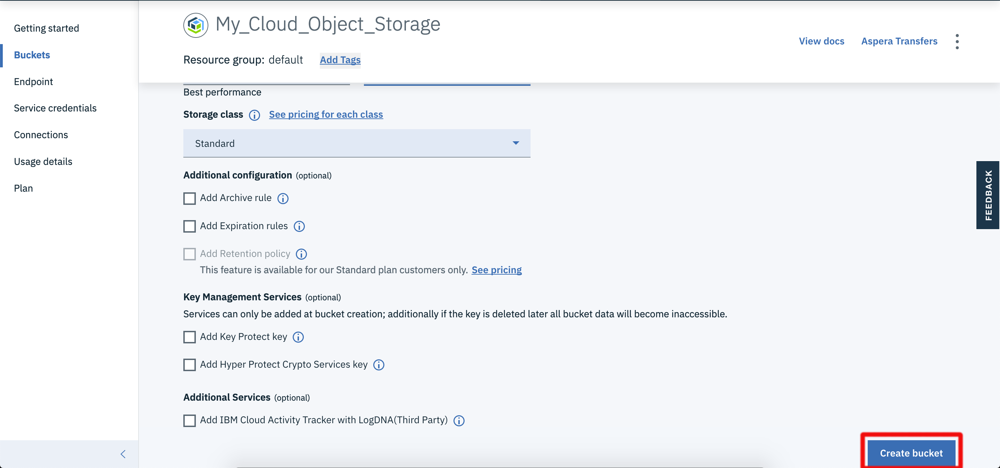
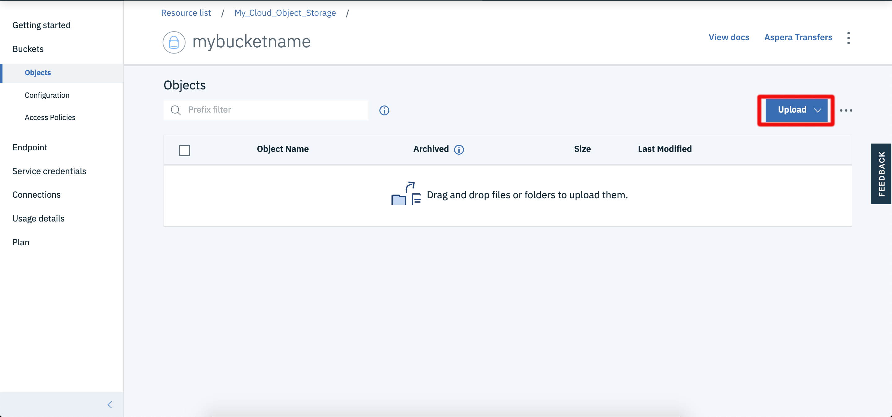

<!--
#
# Licensed to the Apache Software Foundation (ASF) under one or more
# contributor license agreements.  See the NOTICE file distributed with
# this work for additional information regarding copyright ownership.
# The ASF licenses this file to You under the Apache License, Version 2.0
# (the "License"); you may not use this file except in compliance with
# the License.  You may obtain a copy of the License at
#
#     http://www.apache.org/licenses/LICENSE-2.0
#
# Unless required by applicable law or agreed to in writing, software
# distributed under the License is distributed on an "AS IS" BASIS,
# WITHOUT WARRANTIES OR CONDITIONS OF ANY KIND, either express or implied.
# See the License for the specific language governing permissions and
# limitations under the License.
#
-->

# Connecting Cloud Object Storage events to actions

In this example, we will show how to automatically trigger an IBM Cloud Functions action whenever a change is made to a Cloud Object Storage.

## Prerequisites

 Cloud Object Storage change feed requires IAM to authorize access to the Object Storage events; therefore, you must use an IAM namespace to use the Cloud Object Storage change feed. 

* **Cloud Object Storage**
  * Set up [Cloud Object Storage](https://cloud.ibm.com/catalog/services/cloud-object-storage) instance. You can use a lite instance.
    
    * Create a new bucket in the same region as your IBM Cloud Functions instance.
      
      
      
      
    * Authorize service to service access for [IAM](https://cloud.ibm.com/iam/overview)
      
      
      
## Using the Cloudant package

In this exercise, we use the "built-in" [`/whisk.system/cos`](https://github.com/apache/openwhisk-catalog/tree/master/packages/cloudant) package that fire a trigger events that can activate a Cloud Functions action whenever a change is made to the Cloudant database.

You can get a summary of the package and parameters:

```bash
ibmcloud fn package get /whisk.system/cos --summary
```

```bash
package /whisk.system/cos: COS Provider service
   (parameters: *apihost)
 feed   /whisk.system/cos/changes: Event provider COS feed
   (parameters: bucket, endpoint, event_types, prefix, suffix)
```

_**Note** This package only has a feed. Unlike some other packages we have seen, there is no reason to create a package binding since we can bind the relevant things at trigger creation. The reason we have created package bindings in other examples is that so we would not have to consistently pass in new parameters across multiple actions._

## Firing a trigger event with Cloud Object Storage activity

The following is an example of creating a trigger that will be fired each time that there is activity in the `input` bucket.

1. Create a trigger for the Cloud Object Storage `change` events in the bucket using your `/whisk.system/cos/changes` feed

    ```bash
   ibmcloud fn trigger create cosTrigger --feed /whisk.system/cos/changes --param bucket $BUCKET_NAME --param event_types write --param endpoint https://control.cloud-object-storage.cloud.ibm.com/v2/endpoints
    ```
    
    _NOTE_: Change $BUCKET_NAME to your bucket's name.
    
    ```json
    ok: invoked /whisk.system/cos/changes with id e60ec70ea30142a58ec70ea30182a54a
    {
        "activationId": "e60ec70ea30142a58ec70ea30182a54a",
        "annotations": [
            {
                "key": "path",
                "value": "whisk.system/cos/changes"
            },
            {
                "key": "waitTime",
                "value": 83
            },
            {
                "key": "kind",
                "value": "nodejs:10"
            },
            {
                "key": "timeout",
                "value": false
            },
```

    The `/whisk.system/cos/changes` feed action creates a stream that fires the `cosTrigger` trigger when there is write activity in the specified bucket in our Cloud Object Storage.


  **Congratulations!** _Now any write activity on the specified bucket will causes the trigger to be fired. Let's continue by creating a Rule that associatesan actual Action to be invoked._

### Connecting an Action to the Trigger

1. Create a function `cosChange.js`

    ```javascript
    function main(data) {
        console.log("There has been an object written!")
        console.log("The object " + data.notification.object_name + " was written to the bucket " +
                    data.notification.bucket_name + ".")
        return data
    }
    ```

1. Create the Action named `cosChange`

    ```bash
    ibmcloud fn action create cosChange cosChange.js
    ```
    ```bash
    ok: created action cosChange
    ```

    This action receives the a payload with a number of different attributes about the change happening on the bucket. For the purposes of this example we are merely going to log the a message containing the name of the object being written and to which bucket it was written.

1. Connect the `cosTrigger` Trigger to the `cosChange` Action with a Rule named `cosRule`

    ```bash
    ibmcloud fn rule create cosRule cosTrigger cosChange
    ```

    ```bash
    ok: created rule cosRule
    ```

## Test the Cloudant change feed

1. In a separate bash terminal window, start polling for activations

    ```bash
    ibmcloud fn activation poll
    ```
 1. Navigate to our Cloud Object Storage Dashboard in your browser and upload a new object to your bucket using standard upload.

    


    In a few seconds, you should see an activation appear in your polling window that looks  something like:

    ```bash
    Activation: 'cosChange' (7160c80631c24ce6a0c80631c29ce697)
[
    "2020-01-06T21:56:15.464940Z    stdout: There has been an object written!",
    "2020-01-06T21:56:15.464985Z    stdout: The object hippyclown.jpg was written to the bucket pwp-barbaz."
]

Activation: 'cosTrigger' (e57b7a7b10234f7dbb7a7b1023af7de7)
[
    "{\"statusCode\":0,\"success\":true,\"activationId\":\"7160c80631c24ce6a0c80631c29ce697\",\"rule\":\"1f80a00c-4e2c-459e-9059-981eda3a8d93/cosRule\",\"action\":\"1f80a00c-4e2c-459e-9059-981eda3a8d93/cosChange\"}"
]
    ```

  **Congratulations!** _You are now automatically triggering an action based on changes in your Cloud Object Storage!!!!_

# References

* As the `/whisk.system/cos/changes` is an implementation of a feed, you may want to read more on [Implementing feeds](https://github.com/apache/openwhisk/blob/master/docs/feeds.md) in Apache OpenWhisk.
* [Official documentation](https://cloud.ibm.com/docs/services/cloud-object-storage?topic=cloud-object-storage-functions) for using Cloud Object Storage with IBM Cloud Functions.
* IBM Developer's [Modernizing Weather Undergroud with Cloud Object Storage and IBM Cloud Functions](https://developer.ibm.com/articles/modernizing-weather-underground-cloud-object-storage/) shows you how to use IBM Cloud Functions with Cloudant, Kubernetes, and Blockchain technologies.

* [Documentation for Cloud Object Storage](https://cloud.ibm.com/docs/services/cloud-object-storage?topic=cloud-object-storage-getting-started)


