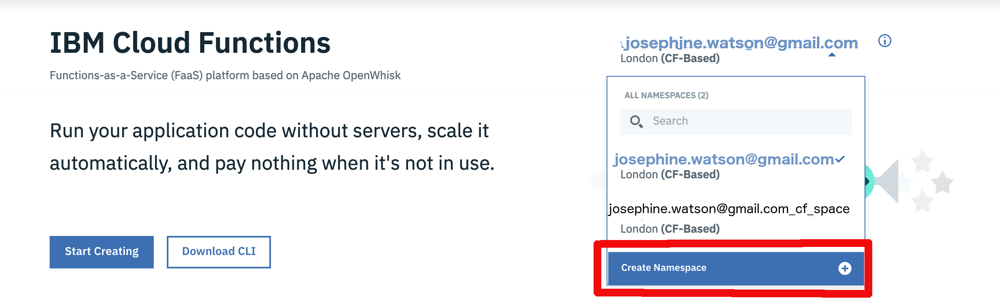
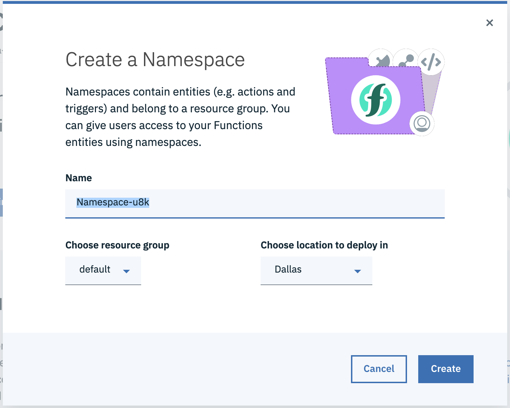

<!--
#
# Licensed to the Apache Software Foundation (ASF) under one or more
# contributor license agreements.  See the NOTICE file distributed with
# this work for additional information regarding copyright ownership.
# The ASF licenses this file to You under the Apache License, Version 2.0
# (the "License"); you may not use this file except in compliance with
# the License.  You may obtain a copy of the License at
#
#     http://www.apache.org/licenses/LICENSE-2.0
#
# Unless required by applicable law or agreed to in writing, software
# distributed under the License is distributed on an "AS IS" BASIS,
# WITHOUT WARRANTIES OR CONDITIONS OF ANY KIND, either express or implied.
# See the License for the specific language governing permissions and
# limitations under the License.
#
-->

## IAM Namespaces [🔗](https://cloud.ibm.com/docs/openwhisk?topic=cloud-functions-namespaces)

This section will describe how to use IAM namespaces with IBM Cloud Functions. IAM stands for Identity and Access Management. IAM namespaces allows all of your resources to be managed using a single unified system. This is a big improvement to the pre-IAM days when each service you used had to have a separate service key -- this quickly could become unwieldy when using more than one or two services.

### Creating an IAM Namespace in IBM Cloud Functions (UI)

  1. Navigate to [IBM Cloud Functions](https://cloud.ibm.com/functions/) and click on the `Create Namespace` button in the drop down menu:
  
  
  2. Select a name, resource group, location, and then click `Create`:
  
  
  3. The newly created namespace should autoselect.
  
That is everything you need to do use IAM namespaces from the UI!

### Creating IAM Namespace (CLI) [🔗](https://cloud.ibm.com/docs/openwhisk?topic=cloud-functions-namespaces#namespaces_create)

    1. You must first ensure you are targeting a [Resource Group](https://cloud.ibm.com/docs/resources?topic=resources-rgs). To do so, we should run
    
  ```bash
✗ ibmcloud target

API endpoint:      https://cloud.ibm.com
Region:            us-south
User:              josephine.watson@gmail.com
Account:           Josephine Watson's Account (87a302ad58884640a45f959d3da6cc77)
Resource group:    No resource group targeted, use 'ibmcloud target -g RESOURCE_GROUP'
CF API endpoint:   https://api.ng.bluemix.net (API version: 2.142.0)
Org:               josephine.watson@gmail.com
Space:             dev
```                                                                                                                                                          
    2. If you are not, you can target your resource group. `default` is a resource group created for all accounts, and is what you should use if you have did
 not explicitly set an additional resource group. You can set that resource group with:
     ```bash
✗ ibmcloud target -g default
Targeted resource group default

                                                                                                                                                             
                                                                                                                                                             
API endpoint:      https://cloud.ibm.com
Region:            us-south
User:              josephine.watson@gmail.com
Account:           Josephine Watson's Account (87a302ad58884640a45f959d3da6cc77)
Resource group:    default
CF API endpoint:   https://api.ng.bluemix.net (API version: 2.142.0)
Org:               josephine.watson@gmail.com
Space:             dev
``` 
  3. Finally, to create a new IAM namespace:
  ```bash
ibmcloud fn namespace create test-namespace --description "My first namespace"
ok: created namespace test-namespace
  ```
  
### Setting up the CLI to use IAM Namespace [🔗](https://cloud.ibm.com/docs/openwhisk?topic=cloud-functions-namespaces#namespaces_create)

NOTE: Steps 1 & 2 are the same as creating a namespace using the CLI. If you created your namespace with CLI, feel free to skip straight to step 3.
  1. You must first ensure you are targeting a [Resource Group](https://cloud.ibm.com/docs/resources?topic=resources-rgs). To do so, we should run 
  ```bash
✗ ibmcloud target

                      
API endpoint:      https://cloud.ibm.com
Region:            us-south
User:              josephine.watson@gmail.com
Account:           Josephine Watson's Account (87a302ad58884640a45f959d3da6cc77)
Resource group:    No resource group targeted, use 'ibmcloud target -g RESOURCE_GROUP'
CF API endpoint:   https://api.ng.bluemix.net (API version: 2.142.0)
Org:               josephine.watson@gmail.com
Space:             dev
```
    2. If you are not, you can target your resource group. `default` is a resource group created for all accounts, and is what you should use if you have did not explicitly set an additional resource group. You can set that resource group with:
    ```bash
✗ ibmcloud target -g default
Targeted resource group default


                      
API endpoint:      https://cloud.ibm.com
Region:            us-south
User:              josephine.watson@gmail.com
Account:           Josephine Watson's Account (87a302ad58884640a45f959d3da6cc77)
Resource group:    default
CF API endpoint:   https://api.ng.bluemix.net (API version: 2.142.0)
Org:               josephine.watson@gmail.com
Space:             dev
```
  3. You can now see your IBM Cloud Functions namespace with the following:
  ```bash
✗ ibmcloud fn namespace list 
name                                     type            id                                       description
josephine.watson@gmail.com_dev           CF-based        joesphine.watson@gmail.com_dev
josephine.watson@gmail.com_cf_namespace  CF-based        josephine.watson@gmail.com_cf_namespace
test-namespace                           IAM-based       9eb5436d-42f4-472a-8f0e-6e5ba1014f0e     My first namespace
  ```
  
  4. To setup your `ibmcloud fn` tool to target your namespace you use
  ```bash
✗ ibmcloud fn property set --namespace test-namespace
ok: whisk namespace set to test-namespace
  ```

You will now be working inside of your new created IAM namespace from the `ibmcloud fn` tool!

### A quick detour into the .wskprops file 

Now we will take a quick detour in order to understand how what we have been doing relates back to your `.wskprops` file. `.wskprops` is the configuration that both `ibmcloud fn` as well as the Apache OpenWhisk commandline tools use to store several values which we will take a tour of now.

    ```bash
APIHOST=us-south.functions.cloud.ibm.com
AUTH=3674bevo-efg0-63e0-a787-2b605532:x7bDJzax6qBqXyg2dCvIPI4SkmSe2k6EyBAqJRVatmX7C5FnedgTzPZF004d9SSx
NAMESPACE=9eb5436d-42f4-472a-8f0e-6e5ba1014f0e
APIGW_ACCESS_TOKEN=eyJhbGciOiJIUzI1NiIsImprdSI6Imadfa0dHBzOi8vdWFhLnVzLXNvdXRoLmNmLmNsb3VkLmlibS5jb20vdG9rZW5fa2V5cyIsImtpZCI6ImtleS0xIiwidHlwIjoiSldUIn0.eyJqdGkiOiJhMGViMjcxMzIyODM0NjdkYTZhMDAzYjI5MjBhZDkyOSIsInN1YiI6IjE0ZkcxNbbzcxLTQxMmQtNGIxZi04ODI4LWFiMTliMzQ2N2Y4ZCIsInNjb3BlIjpbImNsb3VkX2NvbnRyb2xsZXIucmVhZCIsInBhc3N3b3JkLndyaXRlIiwiY2xvdWRfY29udHJvbGxlci53cml0ZSIsIm9wZW5pZCIsIm5ldHdvcmsuYWRtaW4iLCJuZXR3b3JrLndyaXRlIiwidWFhLnVzZXIiXSwiY2xpZW50X2lkIjoiY2YiLCJjaWQiOiJjZiIsImF6cCI6ImNmIiwiZ3JhbnRfdHlwZSI6InBhc3N3b3JkIiwidXNlcl9pZCI6IjE0ZjcxNzcxLTQxMmQtNGIxZi04ODI4LWFiMTliMzQ2N2Y4ZCIsIm9yaWdpbiI6IklCTWlkIiwidXNlcl9uYW1lIjoicHdwbHVzbmlAdXMuaWJtLmNvbSIsImVtYWlsIjoicHdwbHVzbmlAdXMuaWJtLmNvbSIsImF1dGhfdGltZSI6MTU3MzQ5OTE3NywiaWF0IjoxNTczODI5NDM3LCJleHAiOjE1NzM4MzMwMzcsImlzcyI6Imh0dHBzOi8vdWFhLm5nLmJsdWVtaXgubmV0L29hdXRoL3Rva2VuIiwiemlkIjoidWFhIiwiYXVkIjpbImNsb3VkX2NvbnRyb2xsZXIiLCJwYXNzd29yZCIsImNmIiwidWFhIiwib3BlbmlkIiwibmV0d29yayJdLCJpYW1faWQiOiJJQk1pZC0zMTAwMDE1UDE0In0.8yN-tTj-osEGxbH2Onbgcd4yHfXqQApp6TAbktTD10s
APIVERSION=v1
    ```
  * `APIHOST` is the endpoint that the CLI will make rest calls against.
  * `AUTH`
  * `NAMESPACE` is the id of the IAM namespace you just created. If you notice, both the id from the `ibmcloud fn namespace list` and the namespace in the `.wskprops` file match.
  * `APIGW_ACCESS_TOKEN`
  * `APIVERSION` is the version of the OpenWhisk API which will be used.
