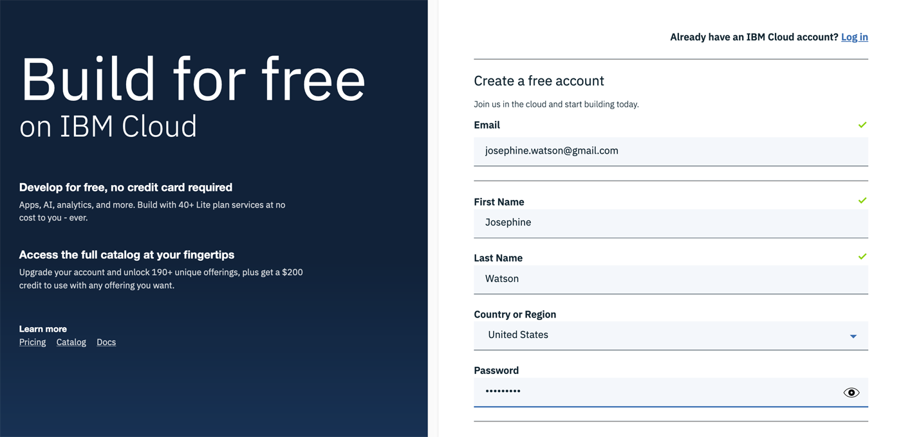
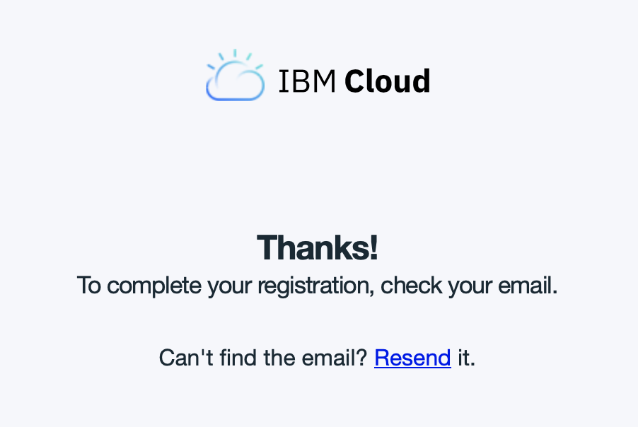
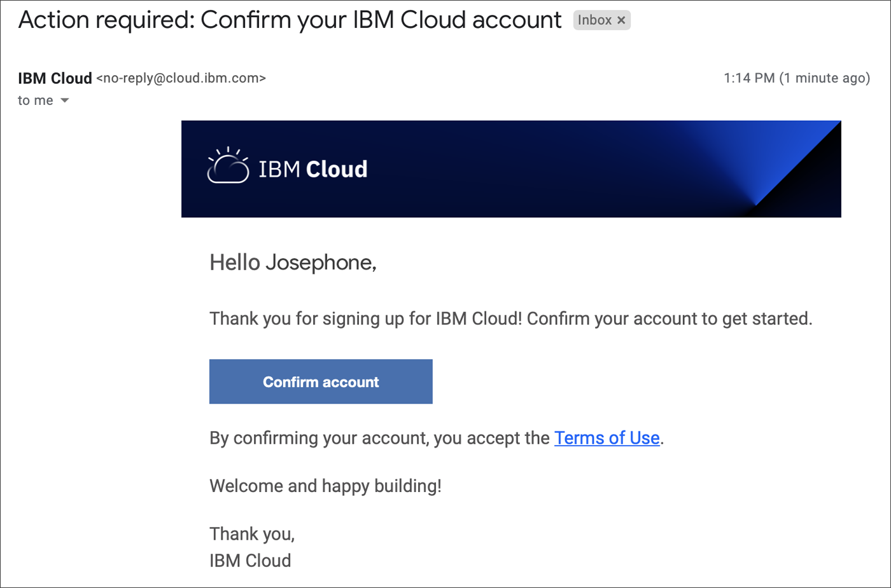
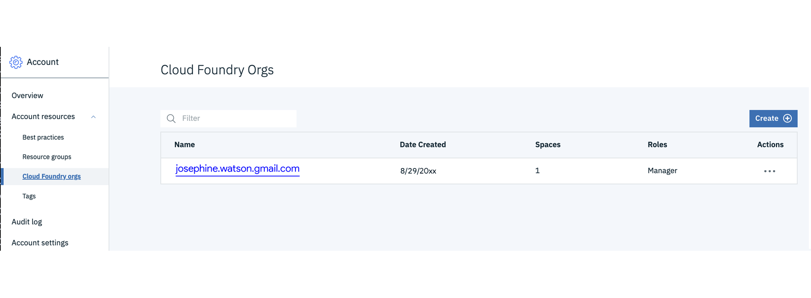
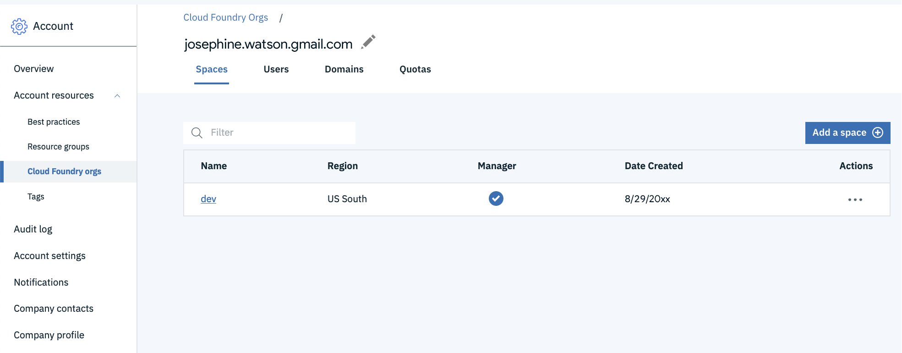

<!--
#
# Licensed to the Apache Software Foundation (ASF) under one or more
# contributor license agreements.  See the NOTICE file distributed with
# this work for additional information regarding copyright ownership.
# The ASF licenses this file to You under the Apache License, Version 2.0
# (the "License"); you may not use this file except in compliance with
# the License.  You may obtain a copy of the License at
#
#     http://www.apache.org/licenses/LICENSE-2.0
#
# Unless required by applicable law or agreed to in writing, software
# distributed under the License is distributed on an "AS IS" BASIS,
# WITHOUT WARRANTIES OR CONDITIONS OF ANY KIND, either express or implied.
# See the License for the specific language governing permissions and
# limitations under the License.
#
-->

# Sign Up for an IBM Cloud Account

You must have a valid IBM Cloud Account to complete exercises in the workshops.

New IBM Cloud accounts default to a [new "lite" account version](https://www.ibm.com/cloud/free/); other [IBM Cloud pricing options](https://www.ibm.com/cloud/pricing) are available if you wish to upgrade at a later time.

_This account provides free access to a subset of IBM Cloud resources, including IBM Cloud Functions. Lite accounts do not need a credit-card to sign up or expire after a set time period, i.e. 30 days._

Developers using "_Lite accounts_" are restricted to development within a single region. Accounts are automatically assigned to either `UK South` or `US South` regions depending on user profile location.

_**Note** IBM Cloud Functions is [available in other regions](https://cloud.ibm.com/docs/openwhisk?topic=cloud-functions-cloudfunctions_regions) as well if you upgrade from a Lite account._

## Create an Account

1. Open a browser window
1. Navigate to [https://cloud.ibm.com/registration](https://cloud.ibm.com/registration)

1. Fill in the registration page:

    

1. Select email preferences, read the Terms and Conditions  and the click the **"Create Account"** button:

    

    You should be directed to verify your account email address:

    

1. Look for the account confirmation email in your inbox:

    

    and click `Confirm account` in the email body which should take you back to IBM Cloud and display a confirmation message:

    

1. [Login into IBM Cloud](https://cloud.ibm.com/) using the account credentials you have registered.


You should be redirected there automatically after confirming the account from the email. Otherwise you can click this link: [https://cloud.ibm.com/](https://cloud.ibm.com/)


## Verify Default Region


**Please follow these instructions** _
We know it looks boring but trust us! People often skim this part and then complain they can't login into the CLI. These instructions will save you all that inevitable confusion..._


Follow these instructions to check which default region your lite account has been assigned.

1. Open the [Cloud Foundry Organizations](https://cloud.ibm.com/account/cloud-foundry) page
1. Click the organization `name` listed in the table.
*Note that your organization is usually the email address you signed up with*

1. Locate the default organization named `dev` and check the associated "_Region_" value listed in the table.


The value should be either `UK South` or `US South`.
**Remember this as the default region value for the next step** (Installing the IBM Cloud CLI).



🎉 **Congratulations, you've successfully registered an IBM Cloud account** 🎉

